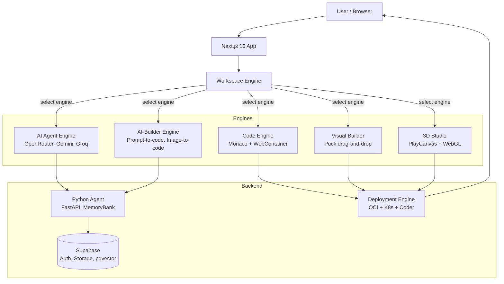

# DreamMakerHub

> **Build anything instantly — no setup required.**
> AI-powered multi-engine development platform.

---

## What Is This?

DreamMakerHub is a unified platform where anyone can launch a dev environment, build with AI/code/visual tools, and deploy — all from one place. No more juggling IDEs, AI tools, hosting, and APIs separately.

---

## How Do I Run It?

```bash
git clone https://github.com/AI-WonderLand1/dreammakerhub.website
cd dreammakerhub.website
npm install
# Create .env.local with your keys (see .env.example)
npm run dev
```

Dev server runs at **localhost:3000**.

Other commands:
```bash
npm run build    # Build all workspaces
npm test         # Run tests (vitest)
npm run lint     # Lint + typecheck
```

---

## 30-Second Quickstart

Here's what it feels like to use DreamMakerHub:

```
1. Open localhost:3000
2. Click "Create Workspace"
3. Select "AI Builder" engine
4. Type "build a landing page for a SaaS startup"
5. Watch the project generate in real time
6. Preview and deploy — done
```

No terminal, no config, no context switching. From idea → running project in under a minute.

---

## Why Should I Care? — Real Demo Flow

### Architecture Overview



---

### Demo 1: Launch a Workspace

**User action:** Clicks "Create Workspace" on the dashboard.

**System response:** Cloud IDE provisions instantly — file tree, terminal, preview panel appear.

**Output:** A full browser-based development environment, ready in seconds.

<p align="center">
  
</p>

---

### Demo 2: Build with AI

**User action:** Selects "AI Builder" engine, types "build a landing page for a SaaS startup".

**System response:** AI generates the full project — React components, styling, animations — streaming in real time.

**Output:** A working landing page with Hero, Features, Pricing sections. Code appears in the editor, preview updates live.

---

### Demo 3: Switch Engines Mid-Project

**User action:** Clicks the engine selector and switches from "AI Builder" to "Code Editor".

**System response:** The same project instantly opens in a Monaco editor. All generated code is fully editable.

**Output:** You can toggle between AI-assisted building and manual coding on the same project, same workspace.

<p align="center">
  
</p>

---

### Demo 4: Deploy to Production

**User action:** Clicks "Deploy" in the workspace toolbar.

**System response:** Build pipeline runs, deploys to OCI Kubernetes, provisions a URL.

**Output:** Live production URL — share it immediately. No cloud console, no CI config, no DevOps setup.

---

### Why This Matters

Most platforms make you choose:
- **Webflow** → design only
- **Replit** → coding only
- **Vercel** → deployment only
- **AI chat tools** → generation only

DreamMakerHub is the only platform where you can go from **idea → AI generation → code editing → deploy** without ever leaving your workspace.

---

## How Is It Built?

### Tech Stack

| Category | Technologies |
|----------|-------------|
| **Frontend** | Next.js 16, React 19, TypeScript 6, Tailwind CSS v4, shadcn/ui |
| **AI** | OpenRouter, Gemini, Groq, GitHub Models, Cerebras |
| **3D** | PlayCanvas, Three.js (@react-three/fiber), Theatre.js |
| **Editor** | Puck (drag-and-drop), Monaco Editor, WebContainer API |
| **Runtime** | OCI Kubernetes (OKE), Coder v2.32.0 |
| **Auth/DB** | Supabase (PostgreSQL + Auth + Storage + Realtime + pgvector) |
| **Payments** | Stripe (Checkout, Billing, Connect) |
| **Infra** | Oracle Cloud (OKE), Terraform, Helm, cert-manager |

### Repository Structure

```
apps/web/                 → Next.js 16 app (pages, API routes)
packages/
  ide-engine/             → WebContainer-based browser IDE
  optimizer/              → 3D asset optimization server
  perf-assets/            → 3D scene performance profiling
  wonder-runtime/         → GLTF transformation server
engine/core/              → AI providers, IDE runtime, orchestration
runners/                  → Background workers (aiWorker, authWorker)
infra/                    → Terraform + K8s manifests for OKE
agent/                    → Python FastAPI backend (Alice agent)
config/ai/                → System prompts, constitution
supabase/                 → Migrations, Edge Functions, local dev
prisma/                   → PostgreSQL schema
ui/                       → Shared UI components (shadcn/ui based)
```

### Architecture Philosophy

**Thin TS / Heavy Python**
- Browser (TS) = Fast I/O, real-time sync, IDE, UI
- Python = Deep reasoning, persistent memory, repo analysis, conversation
- SyncGuard = Bridge with priority-based batching

See [ARCHITECTURE_PLAN.md](./ARCHITECTURE_PLAN.md) for full details.

---

## License

This project is **NOT Open Source**. All original components are **Proprietary** and **All Rights Reserved**. See [COPYRIGHT.txt](./COPYRIGHT.txt) for full terms.

---

<div align="center">

🌐 [dreammakerhub.website](https://www.dreammakerhub.website)

</div>
