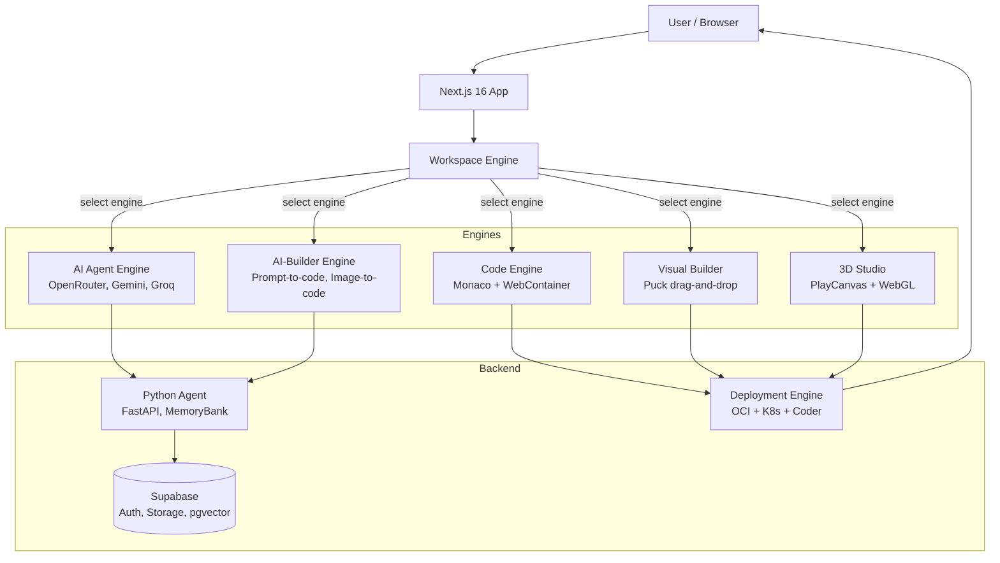
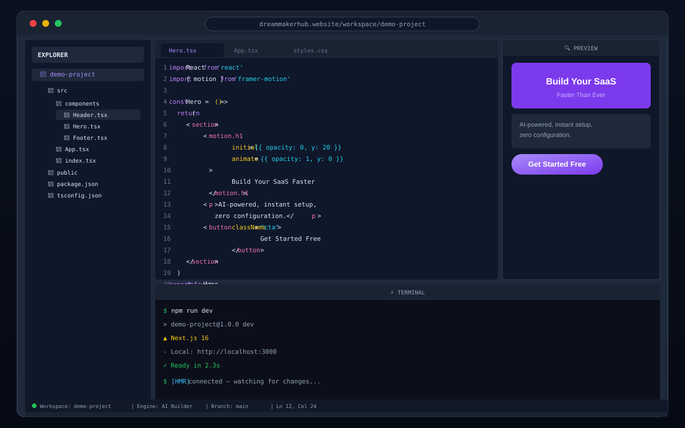
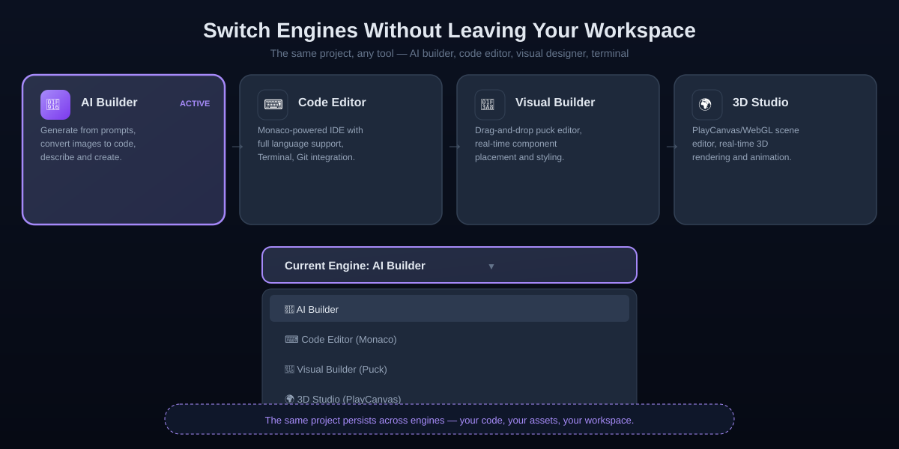

# DreamMakerHub .

> **Build anything instantly — no setup required.**
> AI-powered multi-engine development platform.

---

## What Is This?

DreamMakerHub is a unified platform where anyone can launch a dev environment, build with AI/code/visual tools, and deploy — all from one place. No more juggling IDEs, AI tools, hosting, and APIs separately.

## Overview

WonderSpace is a full-stack platform combining AI-powered development tools, 3D scene building, and collaborative workspaces. The architecture follows a "Thin TS / Heavy Python" philosophy with TypeScript handling the browser experience and orchestration, while Python manages deep reasoning and persistent memory.

DreamMakerHub is a unified platform where anyone can launch a dev environment, build with AI/code/visual tools, and deploy — all from one place. No more juggling IDEs, AI tools, hosting, and APIs separately.

This repository follows npm workspaces with the following main directories:

```
.
├── apps/
│   └── web/                    → Next.js 16 app (React 19, TS 6, Tailwind v4)
├── packages/
│   ├── ide-engine/             → WebContainer + Coder IDE browser runtime
│   ├── optimizer/              → 3D asset optimization server (Fastify)
│   ├── perf-assets/            → 3D scene performance profiling
│   └── wonder-runtime/         → GLTF transformation server (Fastify)
├── engine/core/                → AI providers, orchestration, IDE runtime, memory
├── runners/                    → Background workers (server-only TS)
├── infra/
│   ├── coder/                  → Terraform + K8s for OKE (Coder v2.32)
│   ├── lib/                    → Shared infra (env, logger, Supabase client)
│   ├── services/               → Backend service K8s manifests
│   ├── optimizer/              → Optimizer K8s
│   ├── wonder-runtime/         → Wonder Runtime K8s
│   └── wonderplay/             → Wonder Play K8s
├── config/ai/                  → System prompts, constitution, policy
├── agent/                      → Python FastAPI backend (Alice dual-persona)
├── supabase/                   → Migrations, Edge Functions, local dev
├── prisma/                     → PostgreSQL schema (Supabase Auth + public)
├── ui/                         → Shared UI components (shadcn/ui based)
├── types/                      → Shared TypeScript types
└── runners/                    → Background workers
```

## Module Breakdown

### 1. Frontend Application (apps/web)

#### Route Groups (Next.js App Router)
| Group | Purpose | Key Routes |
|-------|---------|------------|
| `(public)` | Landing, auth, marketing | `/`, `/auth/*`, `/community` |
| `(builder)` | Project builder, Puck editor | `/builder/*`, `/builder-ai/*` |
| `(published)` | Public project viewing | `/[sceneId]`, `/play/*` |
| `(preview)` | Draft preview | `/preview/*` |
| `(workspace)` | IDE workspace, Coder proxy | `/workspace/*`, `/coder-workspace/*` |
| `(tools)` | Dev tools, playgrounds | `/agent-playground`, `/playground/*` |

#### Key Components
- `TriEngineShell.tsx` / `QuadEngineShell.tsx` — Multi-engine rendering shells
- `SpiritGuide.tsx` / `NpcPanel.tsx` — AI character interfaces
- `WebGLStudioHost.tsx` / `DirectPlayCanvasHost.tsx` — 3D engine hosts
- `PuckAIPanel.tsx` — AI-assisted drag-drop builder (Puck)

#### Middleware
- Supabase SSR auth (`@supabase/ssr`)
- Route protection, session refresh
- Coder workspace proxy headers

### 2. AI Engine (engine/core/ai)

#### Model Router (runModel.ts)
```typescript
Model Prefix → Provider
├── github/*  → GitHub Models (gpt-4o-mini, etc.)
├── groq/*    → Groq (llama-3.1-8b-instant, etc.)
├── google/*  → Google AI (gemini-2.5-flash, etc.)
├── opencode/ → OpenCode (opencode/big-pickle)
└── default   → OpenCode
```

#### Providers
- `github.ts` — GitHub Models API
- `groq.ts` — Groq API  
- `google.ts` — Google AI (Gemini)
- `opencode.ts` — OpenCode API
- `openrouter.ts` — OpenRouter (fallback)
- `hybrid.ts` — Multi-provider routing

#### Pipeline v1
```typescript
runAIPipeline(options)
├── CALL_MODEL → runModel()
├── CONSTITUTIONAL_CHECK → evaluateAgainstConstitution()
├── EXTRACT_CONFESSIONS → parseConfessionsFromText() | extractConfessionsWithLLM()
└── EMIT: ProcessStep, Confession, Summary, End events
```

#### Constitutional Evaluator
- Rules from `config/ai/policy.json` + `CONSTITUTION.md`
- Regex-based pattern matching for secrets, PII, self-modification
- Returns violations for confession generation

#### Safety Pipeline
- `detectors.ts` — Secret scanner, PII scanner
- `personalInfoScanner.ts`, `secretScanner.ts`

#### Persona System
- 5 personas: `spirit-guide`, `orchestrator`, `egyptian_voice`, `rick`, `default`
- AI Laws (8 rules) enforced via `FilterGuard` + constitutional pipeline
- DB-backed persona configs (Supabase `persona_configs` table)

### 3. Memory System (Thin TS / Heavy Python Philosophy)

#### Browser (TS) — IndexedDB
```typescript
localMemory (LocalMemoryService)
├── thoughts store (ThoughtEntry: content, persona, timestamp, synced)
├── pendingChanges store (PendingChange: type, path, content, synced)
└── syncQueue store
```

#### Sync Layer
```typescript
SyncGuard (batchSize: 5, interval: 30s)
├── queueThought() → localMemory.saveThought() → batch sync
├── queueChange() → localMemory.savePendingChange() → batch sync
├── syncThoughts() → alice.storeMemory() → markSynced()
├── syncChanges() → alice.storeMemory() → markSynced()
└── forceSync() / getPendingCount()
```

#### Filter Guard
```typescript
validate(content) → ValidationResult
├── Confession patterns → SyncPriority.HIGH
├── AI Law violations → SyncPriority.CRITICAL (strictMode) or HIGH
└── Clean → SyncPriority.STANDARD
```

#### Python Backend (agent/) — Persistent Memory
```typescript
agent/api/main.py (FastAPI, port 8000)
├── /api/spirit-guide/consult → SpiritGuide.consult()
├── /api/orchestrator/execute → Orchestrator.execute()
├── /api/orchestrator/analyze → Orchestrator.analyze_and_plan()
├── /api/memory/store → MemoryBank.store()
├── /api/memory/recall → MemoryBank.recall()
└── /health
```

#### Python Core
- `AliceAgent` — Unified agent with MemoryBank + Neurolink + RepoAnalyzer
- `MemoryBank` — SQLite (data/memory.db): memories, knowledge_bank tables
- `Neurolink` — Graph of activated nodes (spreading activation, connections)
- `FullStackAnalyzer` — Repo structure detection (languages, frameworks, configs)
- `SpiritGuide` / `Orchestrator` — Dual personas with separate prompts

### 4. IDE Engine (packages/ide-engine)

#### WebContainer Manager
- Boot WebContainer (`@webcontainer/api`)
- Mount project filesystem (FileSystemTree)
- File CRUD: readFile, writeFile, deleteFile, createDirectory
- Process spawn: `spawn(command, args)`
- Server ready hook: `onServerReady(port, url)`
- File watch: `watchFile(path, callback)`

#### Coder IDE Manager
- Coder v2 API integration (workspaces, templates)
- Workspace lifecycle: create, waitForReady, getFileTree
- File operations via Coder REST API
- EventEmitter for `ready`, `serverReady` events

### 5. 3D Pipeline

#### Optimizer
- Fastify server for 3D asset optimization
- GLTF/GLB processing, compression, LOD generation
- K8s deployment on OKE

#### Wonder Runtime
- Fastify server for GLTF transformation
- Real-time 3D scene streaming
- K8s deployment with resource limits

#### Perf Assets
- 3D scene performance profiling
- Metrics: draw calls, triangles, texture memory, frame time

#### PlayCanvas Integration
- `apps/web/lib/playcanvas.ts`, `playcanvasBootstrap.ts`
- `DirectPlayCanvasHost.tsx`, `PlayCanvasEditorHost.tsx`
- Theatre.js for animation (`theatreBridgeSetup.ts`)

### 6. Background Runners

| Worker | Purpose | Key Imports |
|--------|---------|-------------|
| `aiWorker.ts` | AI task execution (chat, code, agent, build) | `@core/ai/runModel` |
| `authWorker.ts` | Supabase JWT verification | `@supabase/supabase-js` |
| `aetherguardWorker.ts` | Code quality daemon (ESLint, TS, deps) | `@core/aetherguard/daemon` |
| `data-processing.worker.ts` | Data pipeline tasks | — |
| `fileworkers.ts` | File processing | — |
| `registry.worker.ts` | Asset registry sync | — |

### 7. Infrastructure Services

#### Jobs
- `orchestrateScenePipeline.ts` → generateSceneJson → uploadSceneToTemp → promoteTempScene → saveSceneRecord
- `sceneJob.ts` → SceneGenerationJob type
- `sceneRunnerHarness.ts` → Job execution wrapper

#### Storage
- `SupabaseProvider.ts` → StorageProvider impl (Supabase Storage)
- `generateSceneJson.ts` → Scene JSON generation
- `uploadSceneToTemp.ts` → Temp bucket upload
- `promoteTempScene.ts` → Temp → permanent promotion
- `validateScene.ts` → Schema validation
- `saveSceneRecord.ts` → DB record creation

#### Marketplace
- `MarketplaceAgent.ts` → Marketplace operations

#### Integrations
- `github.ts` → GitHub API

### 8. Database Schema

#### Supabase Auth Schema (auth.*)
- `users`, `sessions`, `identities`, `mfa_factors`, `oauth_*`, `saml_*`, `refresh_tokens`

#### Public Schema (public.*)
| Model | Purpose |
|-------|---------|
| `projects` | User projects (scene_data JSON, puck_layouts) |
| `scenes` | 3D scenes (data JSON, thumbnail) |
| `assets` | 3D assets (file_path, metadata, embeddings) |
| `folders` | Hierarchical folder structure |
| `memories` | AI memory entries (content, embedding vector) |
| `confessions` | AI confession logs |
| `ai_settings` | Per-user AI config |
| `ai_playground_prompts` | Saved prompts |
| `ai_generation_logs` | Generation history |
| `user_projects` | Project templates, SSH, container status |
| `ide_settings` | IDE preferences |
| `secrets` | Encrypted user secrets |
| `subscriptions` | Stripe subscriptions |
| `usage_quotas` | API usage tracking |
| `user_api_tokens` | Encrypted provider keys |

#### Vector Support
- `embedding` columns use `Unsupported("vector")` for pgvector

### 9. Configuration & Policy

#### AI Constitution (config/ai/CONSTITUTION.md)
- 5 Core Principles: No Secrets, No PII, Explainability, Non-Deceptive, Safety First
- Enforcement via policy validator
- Audit logging for blocked content

#### Policy (config/ai/policy.json)
```json
{
  "safety_rules": { "prevent_self_modification": true, "prevent_recursive_orchestration": true, "sandbox_execution_required": true },
  "capabilities": { "build_scope": ["puck_blocks", "playcanvas_scenes", ...], "allowed_tools": ["filesystem_write", ...] },
  "constraints": [...]
}
```

#### Litellm Config (config/litellm/config.yaml)
- Multi-provider routing for Python agent

## 4. Data Flow Architecture

### 4.1 AI Request Flow (Browser → Python)

```
User Input (Browser)
       │
       ▼
FilterGuard.validate()  ──► Priority: STANDARD | HIGH | CRITICAL
       │
       ▼
localMemory.saveThought()  (IndexedDB - instant)
       │
       ▼
SyncGuard.queueThought()  ──► batchSize (5) OR interval (30s)
       │
       ▼
alice.storeMemory()  ──► HTTP POST /api/memory/store
       │
       ▼
Python MemoryBank.store()  (SQLite - persistent)
```

### 4.2 AI Response Flow (Python → Browser)

```
Python Agent (SpiritGuide / Orchestrator)
       │
       ▼
MemoryBank.get_context_for_user()
Neurolink.get_activated_nodes()
       │
       ▼
Gemini API (genai.Client)
       │
       ▼
Response + auto-store to MemoryBank + Neurolink
       │
       ▼
HTTP Response → AliceProxy.consult()/execute()
       │
       ▼
Browser receives answer
```

### 4.3 Constitutional Pipeline Flow

```
runAIPipeline(userPrompt, model, language)
       │
       ├── CALL_MODEL → runModel() → provider routing
       │
       ├── CONSTITUTIONAL_CHECK → evaluateAgainstConstitution(text)
       │       └── violations → createRiskFlagConfession()
       │
       ├── EXTRACT_CONFESSIONS → parseConfessionsFromText() OR LLM extraction
       │       └── createUncertaintyConfession() / createRiskFlagConfession()
       │
       └── EMIT events: ProcessStep, Confession, Summary, End
```

### 4.4 Scene Generation Pipeline

```
orchestrateScenePipeline({ projectId, sceneId, prompt })
       │
       ├── generateSceneJson(job) → scene JSON
       ├── uploadSceneToTemp(jobId, sceneJson, assets) → temp bucket
       ├── promoteTempScene({ jobId, projectId, sceneId }) → permanent URL
       └── saveSceneRecord({ projectId, sceneId, sceneUrl }) → DB record
```

### 4.5 IDE Workspace Flow

```
User opens workspace
       │
       ▼
CoderIDEManager.boot()
       ├── getUserWorkspace() OR createWorkspace(template)
       ├── waitForWorkspaceReady() (poll 30s)
       └── emit('ready', workspace)
       │
       ▼
WebContainerManager.boot()  (parallel for browser IDE)
       ├── WebContainer.boot()
       ├── mountProject(tree)
       └── onServerReady(port, url)
       │
       ▼
File operations: readFile/writeFile/spawn via WebContainer or Coder API
```

## 5. Runtime Execution Paths

### 5.1 Development Mode

```
npm run dev
       │
       ▼ apps/web/scripts/run-dev.mjs
       ├── Next.js dev server (localhost:3000)
       ├── Turbopack compilation
       ├── Middleware: Supabase SSR auth
       ├── API Routes: /api/* (Next.js route handlers)
       └── Hot reload via WebContainer (browser IDE)
```

### 5.2 Production Build

```
npm run build
       │
       ├── apps/web: next build (standalone output)
       ├── packages/*: tsc + bundling
       └── Docker images: apps/web/Dockerfile, packages/*/Dockerfile
```

### 5.3 Production Deploy (OKE - Oracle Kubernetes)

```
GitLab CI: test → release-gates → secret-detection → deploy
       │
       ├── bash scripts/release-gates-check.sh (vitest)
       ├── Manual checklist (docs/release-gates.md)
       ├── Approval jobs: release_gates_manual, production_deploy_approval
       └── Helm/terraform apply (infra/coder/, infra/*/)
```

### 5.4 Python Agent Runtime

```
cd agent && ./run.sh
       │
       ▼ uvicorn agent.api.main:app --host 0.0.0.0 --port 8000
       ├── FastAPI + CORS
       ├── SpiritGuide + Orchestrator (Gemini)
       ├── MemoryBank (SQLite)
       ├── Neurolink (in-memory graph)
       └── RepoAnalyzer (filesystem)
```

### 5.5 AetherGuard Daemon (Code Quality)

```
aetherguardWorker.startAetherGuardWorker()
       │
       ▼ startDaemon() (@core/aetherguard/daemon)
       ├── watchDir() → file changes
       ├── analyzeCode() → AI code review
       ├── checkEslint() / checkTypeScript() / checkDeps()
       └── autofix → applyArtifact() → SyncGuard.queueChange()
```

## 6. Key Interfaces & Contracts

### Path Aliases (tsconfig.base.json)
```typescript
@engine/*     → engine/*
@core/*       → engine/core/*
@lib/*        → apps/web/lib/*
@infra/*       → infra/*
@runners/*    → runners/*
@config/*     → config/*
@components/* → ui/components/*
@ui/*         → ui/*
@types/*      → types/*
@/lib/*       → apps/web/lib/*
@/types/*     → apps/web/types/*
```

### AI Provider Contract
```typescript
interface AIProvider {
  name: string;
  generate(prompt: string | AIContentPart[], options: AIProviderOptions): Promise<AIResponse>;
}

interface AIResponse {
  text: string;
  provider?: string;
  model?: string;
  error?: boolean;
  confessions?: { confidence: number; reasoning: string[]; limitations: string[] };
}
```

### Storage Provider Contract
```typescript
interface StorageProvider {
  upload(path: string, file: StorageFileInput): Promise<StorageOperationResult<StorageUploadData>>;
  download(path: string): Promise<StorageOperationResult<Blob>>;
  remove(path: string): Promise<StorageOperationResult<StorageRemovedItem[]>>;
  list(path: string): Promise<StorageOperationResult<StorageListItem[]>>;
}
```

## 7. Security Boundaries

| Layer | Mechanism |
|-------|-----------|
| **Auth** | Supabase Auth (JWT, PKCE, MFA, WebAuthn), `@supabase/ssr` middleware |
| **API Keys** | Oracle Vault (`apps/web/lib/oracle-vault.ts`), encrypted in `user_api_tokens` |
| **Secrets** | External-secrets operator (K8s), `.env` never committed |
| **AI Safety** | Constitutional pipeline (policy.json + CONSTITUTION.md), secret/PII scanners |
| **Sandbox** | WebContainer (browser), Coder workspaces (K8s pods), policy: `sandbox_execution_required: true` |
| **RLS** | Supabase Row Level Security on all public tables |
| **Rate Limits** | `usage_quotas` table, API key manager (`agent/core/api_keys.py`) |

## 8. External Dependencies

| Category | Dependencies |
|----------|-------------|
| **AI Providers** | OpenRouter, Groq, GitHub Models, Google Gemini, OpenCode, Cerebras |
| **3D** | PlayCanvas, Three.js (@react-three/fiber), Theatre.js, GLTF |
| **Editor** | Puck (@puckeditor/core), Monaco Editor, xterm.js |
| **Auth/DB** | Supabase (PostgreSQL + Auth + Storage + Realtime + pgvector) |
| **Infra** | Oracle Cloud (OKE), Coder v2.32, Terraform, Helm, cert-manager |
| **Payments** | Stripe (Checkout, Billing, Connect) |
| **Observability** | Custom logger, audit_log_entries (Supabase) |

## 9. Development Commands

### Quick Commands
```bash
# Dev server (runs web workspace on :3000)
npm run dev

# Build all workspaces
npm run build

# Tests (vitest)
npm test
npm run test:watch

# Lint + typecheck
npm run lint
npx ts-prune          # find unused exports

# Release gates
bash scripts/release-gates-check.sh
```

## 10. Technology Notes

### Framework Stack
- **Frontend**: Next.js 16 + React 19 + TypeScript 6 + Tailwind CSS v4 + shadcn/ui
- **AI**: OpenRouter ecosystem, Gemini (Google), Groq, GitHub Models
- **3D**: PlayCanvas + Three.js (@react-three/fiber) + Theatre.js
- **Editor**: Puck (drag-and-drop) + Monaco Editor + WebContainer API
- **Runtime**: OCI Kubernetes (OKE), Coder v2.32.0

### Database Architecture
- **Supabase**: Auth, Storage (pgvector), Edge Functions
- **PostgreSQL**: Public schema with 25+ tables (projects, scenes, assets, memories)
- **Vector Search**: pgvector for AI embeddings

### Communication Patterns
- **Event-Driven**: SyncGuard (batched sync), statusStream (pipeline events)
- **Request-Response**: API endpoints, HTTP calls between browser ↔ Python
- **Stream Processing**: Scene pipeline (generate → temp → promote → persist)

### Architecture Philosophy
"Thin TS / Heavy Python"
---

## How Do I Run It?

```bash
git clone https://github.com/AI-WonderLand1/dreammakerhub.website
cd dreammakerhub.website
npm install
# Create .env.local with your keys (see .env.example)
npm run dev
```

Dev server runs at **localhost:3000**.

Other commands:
```bash
npm run build    # Build all workspaces
npm test         # Run tests (vitest)
npm run lint     # Lint + typecheck
```

---

## 30-Second Quickstart

Here's what it feels like to use DreamMakerHub:

```
1. Open localhost:3000
2. Click "Create Workspace"
3. Select "AI Builder" engine
4. Type "build a landing page for a SaaS startup"
5. Watch the project generate in real time
6. Preview and deploy — done
```

No terminal, no config, no context switching. From idea → running project in under a minute.

---

## Why Should I Care? — Real Demo Flow

### Architecture Overview



---

### Demo 1: Launch a Workspace

**User action:** Clicks "Create Workspace" on the dashboard.

**System response:** Cloud IDE provisions instantly — file tree, terminal, preview panel appear.

**Output:** A full browser-based development environment, ready in seconds.

<p align="center">
  
</p>

---

### Demo 2: Build with AI

**User action:** Selects "AI Builder" engine, types "build a landing page for a SaaS startup".

**System response:** AI generates the full project — React components, styling, animations — streaming in real time.

**Output:** A working landing page with Hero, Features, Pricing sections. Code appears in the editor, preview updates live.

---

### Demo 3: Switch Engines Mid-Project

**User action:** Clicks the engine selector and switches from "AI Builder" to "Code Editor".

**System response:** The same project instantly opens in a Monaco editor. All generated code is fully editable.

**Output:** You can toggle between AI-assisted building and manual coding on the same project, same workspace.

<p align="center">
  
</p>

---

### Demo 4: Deploy to Production

**User action:** Clicks "Deploy" in the workspace toolbar.

**System response:** Build pipeline runs, deploys to OCI Kubernetes, provisions a URL.

**Output:** Live production URL — share it immediately. No cloud console, no CI config, no DevOps setup.

---

### Why This Matters

Most platforms make you choose:
- **Webflow** → design only
- **Replit** → coding only
- **Vercel** → deployment only
- **AI chat tools** → generation only

DreamMakerHub is the only platform where you can go from **idea → AI generation → code editing → deploy** without ever leaving your workspace.

---

## How Is It Built?

### Tech Stack

| Category | Technologies |
|----------|-------------|
| **Frontend** | Next.js 16, React 19, TypeScript 6, Tailwind CSS v4, shadcn/ui |
| **AI** | OpenRouter, Gemini, Groq, GitHub Models, Cerebras |
| **3D** | PlayCanvas, Three.js (@react-three/fiber), Theatre.js |
| **Editor** | Puck (drag-and-drop), Monaco Editor, WebContainer API |
| **Runtime** | OCI Kubernetes (OKE), Coder v2.32.0 |
| **Auth/DB** | Supabase (PostgreSQL + Auth + Storage + Realtime + pgvector) |
| **Payments** | Stripe (Checkout, Billing, Connect) |
| **Infra** | Oracle Cloud (OKE), Terraform, Helm, cert-manager |

### Repository Structure

```
apps/web/                 → Next.js 16 app (pages, API routes)
packages/
  ide-engine/             → WebContainer-based browser IDE
  optimizer/              → 3D asset optimization server
  perf-assets/            → 3D scene performance profiling
  wonder-runtime/         → GLTF transformation server
engine/core/              → AI providers, IDE runtime, orchestration
runners/                  → Background workers (aiWorker, authWorker)
infra/                    → Terraform + K8s manifests for OKE
agent/                    → Python FastAPI backend (Alice agent)
config/ai/                → System prompts, constitution
supabase/                 → Migrations, Edge Functions, local dev
prisma/                   → PostgreSQL schema
ui/                       → Shared UI components (shadcn/ui based)
```

### Architecture Philosophy

**Thin TS / Heavy Python**
- Browser (TS) = Fast I/O, real-time sync, IDE, UI
- Python = Deep reasoning, persistent memory, repo analysis, conversation
- SyncGuard = Bridge with priority-based batching

See [ARCHITECTURE_PLAN.md](./ARCHITECTURE_PLAN.md) for full details.

---

## License

This project is **NOT Open Source**. All original components are **Proprietary** and **All Rights Reserved**. See [COPYRIGHT.txt](./COPYRIGHT.txt) for full terms.

---

<div align="center">

🌐 [dreammakerhub.website](https://www.dreammakerhub.website)

</div>
