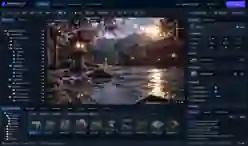
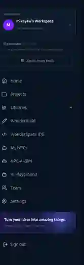

# DreamMakerHub master TODO

> One task file for the main repository, consolidated September 20, 2026. Old unchecked boxes do not prove an issue is still open: verify against current code and a real browser before marking anything complete. All six source TODOs are preserved verbatim below. New tasks belong here, not in new TODO files.

## Fix what's not working first

- [ ] **WonderPlay engine:** reproduce and resolve the actual `E.Entity is not a constructor` error before claiming the 3D viewport works. Verify PlayCanvas imports and initialization in a browser.
- [ ] **Project load (500):** reproduce with an authenticated real project; fix underlying storage/auth error and test save, reopen, and project isolation. Never fabricate a default project to hide the error.
- [ ] **One-page WonderPlay:** keep the Outliner, real PlayCanvas viewport, Details/AI controls, bottom Content Browser, 360 View, Game Builder and Movie Maker on the single `/dashboard/3dhub` route. No extra wizard or project re-selection.
- [ ] **Canvas space:** verify the normal dashboard sidebar/header are hidden only inside WonderPlay and the compact top Navigate menu works by mouse, keyboard and on mobile. [Navigation PR #502](https://github.com/AI-WonderLand1/dreammakerhub.website/pull/502) was merged; deployment/browser behavior still needs checking.
- [ ] **Real Outliner and inspector:** list actual scene objects, selection, transforms, lights/materials and gizmos rather than only project files. Real asset thumbnails belong in the bottom browser.
- [ ] **Graphics:** add PBR materials, lighting, shadows, reflection choices, selection outline, grid and Low/Balanced/High settings to the existing PlayCanvas renderer. A Unity-inspired visual style does not mean installing Unity.
- [ ] **Authentic homepage imagery:** replace schematic/random images with genuine screenshots of working product surfaces. Do not use screenshots with visible errors as successful product demonstrations.
- [ ] **WonderBuild:** verify template fidelity, nested drag/drop, graphics rendering, AI assistant, project persistence, live Preview and Publish in a real browser. Keep Start → Build (+ Preview) → Publish.
- [ ] **WonderSpace:** validate Coder login, workspace launch, files, terminal, persistence and per-user isolation, rather than assuming mockup imagery proves IDE readiness.
- [ ] **Hosting safety:** back up any UpCloud-only files and test an AWS fallback without changing live DNS or starting resources through this TODO update.
- [ ] **Release gate:** test build, authenticated flows and mobile/desktop layouts; distinguish CI success from deployment and actual runtime success.

## WonderPlay image references

**Target concept, AI-generated illustration, not a screenshot of implemented functionality:**



**Existing full-height dashboard sidebar, provided screenshot. It must not occupy permanent canvas width in WonderPlay:**



Target: top navigation, scene Outliner at left, large unobstructed viewport, Details at right, and Content Browser below, all on one page. The references are layout goals, not proof these features work.

## Historical task lists, consolidated without dropping checkboxes

All original wording and checkboxes follow. Some are older aspirations or completed work; confirm status before changing them.

---

<a id="wonderbuild"></a>
## Imported from `TODO.md`: WonderBuild

# WonderBuild Website Builder — 3-Step Flow TODO

## Scope guardrail

This work is **ONLY** for the WonderBuild website-builder experience in `dreammakerhub.website`.

Do **not** restructure, merge, rename, or repurpose:

- NPC-AI-SIM
- WonderPlay
- PlayCanvas/WebGL game or scene tooling
- NPC simulation/runtime code
- dedicated 3D/game routes

Website-builder 3D support means normal **web media assets** only. It does **not** mean a 3D scene editor.

### WonderBuild graphics / 3D asset rule

Allowed inside WonderBuild websites and templates:

- high-quality raster graphics and generated artwork
- SVG/icon graphics
- animated decorative web graphics
- image/video hero media
- GLB/GLTF models rendered as normal website content
- product/model viewers
- simple interactive 3D embeds that behave like a web component
- 3D hero/product assets used inside a normal website layout

Not part of WonderBuild:

- game-engine scene editing
- world/level editors
- scene graphs exposed as a game-development workflow
- NPC simulation tooling
- physics/gameplay systems
- WonderPlay editor features
- general PlayCanvas/WebGL scene-authoring UI

If a 3D asset is placed in WonderBuild, the user should treat it like an **image/video/component on a webpage**: insert it, size it, position it, configure presentation, preview it, and publish it.

---

## Product model

Authentication is outside the three build steps.

```text
LOGIN / REGISTER
      ↓
DASHBOARD / PROJECTS
      ↓
1. START
   - Blank website
   - Choose template
   - Generate with AI
      ↓
2. BUILD
   - Drag/drop
   - AI editing
   - Pages
   - CMS
   - Assets (images/video/3D web assets)
   - Components
   - Code when needed
   - Responsive design
   - Preview as an editor mode
      ↓
3. PUBLISH
   - Domain
   - SEO
   - validation
   - go live
```

Mental model: **START → BUILD (+ Preview) → PUBLISH**.

There are only **three user-facing workflow steps**. Blank / Template / AI are choices inside START. Pages / Insert / CMS / Assets / Components / Design / Interact / AI Assist / Code / Preview are tools inside BUILD. Domain / SEO / validation / deployment are tools inside PUBLISH.

Internal implementation details such as project creation, template conversion, `builder-state.json` seeding, renderer handoffs, autosave, revisions, persistence, adapters, APIs, and deployment plumbing must **never become extra user-facing steps**.

---

# Visual / UX source of truth

The current reference screenshots supplied for WonderBuild define the intended **product layout and interaction model**. They are not decorative mockups; they are the target for how the three-step product should feel and behave.

## STEP 1 — START layout

### START home

`/wonder-build`

Purpose: let the user choose how to begin, then move directly into BUILD.

Required structure:

```text
┌─────────────────────────────────────────────────────────────┐
│ WonderBuild                      1 START → 2 BUILD → 3 PUBLISH │
├─────────────────────────────────────────────────────────────┤
│                                                             │
│  START YOUR WEBSITE                                         │
│  Blank             Template             Generate with AI    │
│                                                             │
└─────────────────────────────────────────────────────────────┘
```

Rules:

- START is Step 1.
- Blank / Template / AI are **choices**, not additional numbered workflow steps.
- Creating/seeding a project happens behind the scenes.
- Every successful START choice lands directly in `/wonder-build/builder?projectId=...`.

### Template START page — target layout

`/wonder-build/templates`

The supplied template-library screenshot is the visual target.

Required shell:

```text
TOP BAR
WonderBuild | Home | Templates | AI Generate | My Projects | Assets | Learn
                                      Search templates | notifications | account

LEFT SIDEBAR
+ Create a Website
Templates
AI Generate
My Projects
Assets
Components
Domains
Integrations
Settings

MAIN HERO
Large high-impact visual / graphic
"Stunning Templates for Any Vision"
Search
feature/value badges

FILTER BAR
All | Business | Ecommerce | Portfolio | Blog | SaaS | Creative | ...
Sort / Popular

TEMPLATE GRID
large visual thumbnails
name + category
Preview
Use Template

AI HELP CARD
Ask AI to find a template or generate one
```

Functional requirements:

- [ ] Template search works.
- [ ] Category filters work.
- [ ] Sort/filter controls work.
- [ ] Preview opens a quick preview only.
- [ ] **Use Template** creates/seeds the project and opens BUILD directly.
- [ ] AI Generate stays inside START and also opens BUILD directly after generation.
- [ ] My Projects returns to project management without introducing a new builder step.
- [ ] Assets is a library/tool destination, not a new workflow stage.
- [ ] Template thumbnails use real polished graphics/screenshots, not generic placeholder cards.
- [ ] Hero area uses high-impact graphics consistent with the WonderBuild visual identity.
- [ ] No Deploy screen between template choice and BUILD.

## STEP 2 — BUILD layout

`/wonder-build/builder?projectId=...`

The supplied professional builder screenshot is the target layout.

Required shell:

```text
┌────────────────────────────────────────────────────────────────────────────┐
│ WonderBuild | Project name | Saved | device width | zoom | undo/redo       │
│                                               Preview | Publish | Deploy     │
├──────┬───────────────────────┬─────────────────────────────┬─────────────────┤
│ TOOL │ PAGES / INSERT / CMS  │                             │ DESIGN          │
│ RAIL │ ASSETS / COMPONENTS   │         LIVE CANVAS         │ INTERACT        │
│      │                       │                             │ AI ASSIST       │
│      │ Pages tree            │  select / drag / resize     │                 │
│      │                       │  drop / edit in place       │ Inspector       │
│      │ Layers tree           │                             │ controls        │
│      │                       │                             │                 │
└──────┴───────────────────────┴─────────────────────────────┴─────────────────┘
```

### BUILD top bar

Must provide:

- project name
- saved/autosave state
- desktop/tablet/mobile breakpoint controls
- width/viewport context
- zoom
- undo/redo
- Preview
- Publish
- deployment/go-live entry where appropriate

The builder must have **one coherent chrome layer**. Do not stack multiple competing headers/toolbars.

### BUILD left side

Primary tool rail / tabs:

- Pages
- Insert
- CMS
- Assets
- Components

Pages mode must show:

- searchable page list/tree
- Home clearly identified
- active page clearly highlighted
- Add Page
- rename
- page slug/path where useful
- Layers visible in the same site-building mental model

Insert mode must show:

- searchable component/block catalog
- categories
- drag onto canvas
- click to insert
- block library must not dominate the whole editor

### BUILD canvas

The canvas is a **real website page frame**, not a game-editor/infinite-world canvas.

Must support:

- drag blocks from Insert to canvas
- reorder blocks
- nested containers
- drag existing elements between valid containers
- visual selected-element outline
- floating selected-element toolbar
- direct route to Design inspector
- direct route to AI Assist for the selected element
- delete/duplicate actions
- resize handles
- alignment guides
- snapping feedback
- desktop/tablet/mobile page widths
- live visual updates
- scrolling as a website page
- zoom/pan only as editor navigation, not as the product mental model

Drag/drop correctness requirements:

- [ ] Root drop works.
- [ ] Nested container drop works at any depth.
- [ ] Reorder works at root.
- [ ] Reorder works inside nested containers.
- [ ] Move between containers works.
- [ ] Invalid child types are rejected using the real parent block type.
- [ ] A container cannot be dropped into its own descendants.
- [ ] Layers stay synchronized with canvas ordering/nesting.
- [ ] Pages remain isolated from each other.
- [ ] Undo/redo cannot leak content between pages.

### BUILD right side

Top-level modes:

- **Design**
- **Interact**
- **AI Assist**

Design must expose professional controls for the selected element:

- selector/current element
- layout
- flex/grid
- direction
- alignment
- justify
- gap
- wrap
- spacing / margin / padding
- width/height/min/max
- overflow
- typography
- color
- background
- borders/radius
- effects where appropriate
- responsive overrides
- accessibility

Interact must expose usable website interactions, not game logic:

- navigate/link
- scroll-to
- modal/toggle behavior
- hover effects
- basic animation/transitions
- form/webhook actions where supported and secured

AI Assist must operate on the **same live builder state** as drag/drop and Design.

AI must know:

- active page
- selected element
- element type
- element props
- element styles
- allowed block catalog

AI actions must support, at minimum:

- add a block to the page
- add a block inside a selected valid container
- edit selected element text/props
- edit selected element styles
- restyle a selected element
- make selected content more responsive
- help generate a section/page layout

AI must use the same Zustand/store actions and canonical page state as manual editing. It must **not** maintain a second hidden editable document.

### BUILD graphics quality

The builder itself should visually match the supplied dark professional reference:

- deep navy/black editor chrome
- violet/indigo/cyan accent lighting
- compact professional controls
- clear selected states
- strong typography hierarchy
- polished icons
- subtle glow rather than giant generic gradient cards
- high-quality template/site graphics in the canvas
- no toy-like emoji-first editor chrome once equivalent icons exist

The visual target is closer to a professional Framer/Webflow-class editor than a generic admin dashboard.

## STEP 3 — PUBLISH layout

Publish remains Step 3 and is reachable directly from BUILD.

Required responsibilities:

- publish the complete multi-page site
- generated site URLs
- domain/custom domain
- SEO title/description/social image
- validation/checklist
- publish status
- revision/republish behavior
- final go-live action

Do not add another required "Deploy Builder", "Visual Renderer", or "Export then Publish" workflow stage.

---

## Route/code audit

### Auth

- Canonical auth UI: `/public-pages/auth`.
- `/auth/login` redirects there.
- Auth supports a sanitized `redirectTo`.
- Default authenticated destination is `/dashboard/projects`.

### Dashboard/projects

File: `apps/web/app/(workspace)/dashboard/projects/page.tsx`

Original issue:

- WonderBuild projects linked to `/wonder-build?projectId=...` instead of the real editor.
- Creating a project left the user on the project list instead of entering the website editor.

First-pass fix:

- Existing WonderBuild projects now link directly to `/wonder-build/builder?projectId=...`.
- New WonderBuild projects immediately open the canonical builder.
- WonderPlay/PlayCanvas project creation remains a separate behavior.

### `/wonder-build`

File: `apps/web/app/(builder)/wonder-build/page.tsx`

Original issue:

- `/wonder-build` directly rendered the large template/batch app, making template selection, AI tools, previewing, and building look like one confusing pre-builder application.

First-pass fix:

- `/wonder-build` is now the **START** screen.
- It presents only three primary choices: Blank, Template, AI.
- Blank creates the project behind the scenes and goes directly to Builder.
- Old `/wonder-build?projectId=...` links are compatibility-routed into the real builder.

### `/wonder-build/templates`

File: `apps/web/app/(builder)/wonder-build/templates/page.tsx`

Original issue:

- It rendered the template app but `next.config.mjs` immediately redirected it back to `/wonder-build`, so two route implementations existed for one screen.

First-pass fix:

- The redirect was removed.
- `/wonder-build/templates` is now a Step-1 subflow for choosing/generating a starting point.

### Template-library internal flow

Main file: `apps/web/lib/wonder-build/template-library/App.tsx`

Original issue:

```text
Template / AI
   ↓
VisualRenderer
   ↓
Deploy modal
   ↓
Create project
   ↓
Convert state
   ↓
Real Builder
```

First-pass fix:

```text
Template / AI
   ↓
Create + seed project
   ↓
Real Builder
```

- Template Customize/Edit actions now call `handleOpenInBuilder()` directly.
- AI-generated templates now open the real builder directly.
- Search-grounded generated templates do the same.
- The Deploy modal is no longer the gateway to the actual editor.
- The old internal Visual Renderer is labeled **Quick Preview** and is no longer the main Customize destination.

### Duplicate website-builder models

Files:

- `apps/web/lib/wonder-build/template-library/types.ts`
- `apps/web/lib/wonder-build/template-library/utils/builderAdapter.ts`
- `apps/web/lib/builder/types.ts`

Current technical flow still contains:

```text
WonderBuildTemplate / WonderBuildElement
        ↓
builderAdapter
        ↓
CanvasElement[]
        ↓
VisualBuilderCanvas
```

Risk:

- Two editable schemas can drift.
- Adapter mappings can lose information.
- There is no obvious reverse round-trip.

Long-term target:

```text
Template / AI generation
        ↓
canonical builder state
        ↓
VisualBuilderCanvas
```

Do **not** delete the adapter until existing templates are migrated safely.

### Canonical website editor

Route: `/wonder-build/builder`

Main file: `apps/web/app/(builder)/wonder-build/builder/page.tsx`

Already contains:

- drag/drop canvas
- component library
- inspector
- layers
- templates
- files
- revisions/history
- AI assistant panel
- import/export
- Code / Design / Preview tabs
- project persistence/pipeline
- publish controls

Therefore:

- **AI belongs inside BUILD.**
- **Preview belongs inside BUILD.**
- **Publish is Step 3.**

### Website-builder navigation

File: `apps/web/app/(builder)/wonder-build/components/SovereignNavBar.tsx`

Original links mixed Hub / Agent / Builder / 3D / Dashboard.

First-pass website-builder chrome now emphasizes:

- Projects
- Start
- Build
- Publish

The Agent and 3D routes were not deleted. They were removed from the primary website-builder flow only.

### Global footer leak

File: `apps/web/app/layout.tsx`

Original issue:

- Marketing `<Footer />` rendered below full-screen editors.

First-pass fix:

- Added `apps/web/components/RouteAwareFooter.tsx`.
- Marketing footer is hidden on WonderBuild website-builder/start/template/editor surfaces.
- Unrelated WonderPlay/3D routes remain untouched.

### Preview route

`next.config.mjs` keeps:

- `/wonder-build/preview` → `/wonder-build/builder?tab=preview`

This is the desired architecture.

### Stale website-builder routes

First-pass compatibility shims:

- `/wonder-build/studio` → `/wonder-build`
- `/wonder-build/ai-builder` → `/wonder-build`

These shims apply to stale WonderBuild website links only; they do not alter NPC/WonderPlay studio code.

### Central navigation

File: `apps/web/lib/navigation.ts`

First-pass BUILD navigation now presents one WonderBuild product:

- Start Website
- Templates
- Website Builder

with the tagline:

**Start → Build + Preview → Publish**

WonderSpace/CODE and WonderPlay/3D registry sections remain separate.

---

## Phase 1 — Routing and workflow consolidation

- [x] Audit auth, dashboard, WonderBuild, template, builder, preview, publish, and primary navigation routes.
- [x] Confirm `/wonder-build/builder` as canonical website editor.
- [x] Confirm Preview is already an editor mode via `?tab=preview`.
- [x] Fix Dashboard WonderBuild project links to open canonical builder.
- [x] Open newly created Dashboard WonderBuild projects immediately in Builder.
- [x] Keep WonderPlay project creation separate.
- [x] Make template Customize/Edit actions call `handleOpenInBuilder()` directly.
- [x] Rename retained Visual Renderer UI to Quick Preview.
- [x] Remove Deploy as the required gateway into the real builder.
- [x] Keep Publish in the real builder.
- [x] Correct website-builder metadata that described it as a 3D/game editor.
- [x] Hide global marketing footer from full-screen WonderBuild website surfaces.
- [x] Add compatibility handling for stale WonderBuild Studio/AI-builder URLs.
- [ ] Simplify the duplicated/stacked headers inside `/wonder-build/builder` so the editor has one coherent chrome layer.
- [ ] Change remaining `Hub` wording inside Builder to `Start` or `Projects` where appropriate.
- [ ] Audit visible numbering/labels so only START / BUILD / PUBLISH are presented as workflow steps.

## Phase 2 — START experience

- [x] `/wonder-build` shows three primary choices: Blank / Template / AI.
- [x] Blank website project creation happens behind the scenes.
- [x] Template selection seeds builder state and opens Builder.
- [x] AI generation seeds builder state and opens Builder.
- [x] Keep batch/template power tools as secondary Start tools rather than workflow stages.
- [x] Stop using VisualRenderer as the normal editing destination.
- [ ] Remove misleading `01 / 02 / 03` numbering from Blank / Template / AI cards; they are choices inside Step 1, not three more steps.
- [ ] Bring `/wonder-build/templates` to the supplied high-impact template-library layout.
- [ ] Add real polished template thumbnails/graphics.
- [ ] Make template search/category/sort controls functional.
- [ ] Add proper loading/progress UI for project creation and template seeding.
- [ ] Add failure recovery if project is created but template state seeding fails.

## Phase 3 — BUILD: Framer + WordPress feel (website builder only)

- [ ] Match the supplied professional builder shell/layout.
- [ ] Make Pages a first-class panel/navigation concept.
- [ ] Add site-level structure instead of a block-library-first mental model.
- [ ] Keep Pages and Layers synchronized and usable together.
- [ ] Fix nested drag/drop so valid containers work at any depth.
- [ ] Add regression coverage for nested add/move/reorder/duplicate behavior.
- [ ] Add contextual floating selected-element controls.
- [ ] Make AI operate on active page + selected element using the same canonical store.
- [ ] Add CMS collections/posts/custom content management.
- [ ] Add unified Assets library for images, video, documents, and simple 3D web assets.
- [ ] Add reusable components/global sections.
- [ ] Add global styles/design tokens.
- [ ] Improve responsive controls/breakpoints.
- [ ] Add Framer-like resize handles.
- [ ] Add alignment guides/snapping feedback.
- [ ] Add stronger flex/grid/layout controls.
- [ ] Add positioning controls without turning the product into a game/scene editor.
- [ ] Move the large block catalog behind Insert/Search so it does not dominate the editor.
- [ ] Keep AI editing available contextually in the same editor.
- [ ] Make Design / Interact / AI Assist the primary right-panel mental model.
- [ ] Replace placeholder/toy-like editor visuals with polished icons/graphics where practical.

## Phase 4 — Canonical website data model

- [ ] Define builder state/`CanvasElement` model as the canonical editable representation.
- [ ] Make templates generate canonical builder state directly where practical.
- [ ] Make AI generation target canonical builder state.
- [ ] Reduce lossy `WonderBuildElement → CanvasElement` conversions.
- [ ] Add migration/compatibility for existing templates before removing old model code.

## Phase 5 — PUBLISH

- [ ] Consolidate domain setup into Publish.
- [ ] Add SEO title/description/social-image controls.
- [ ] Add final validation/checklist before go-live.
- [ ] Confirm custom domain, generated page, revision, and republish behavior.
- [ ] Keep Publish as Step 3 reachable directly from Builder.

---

## CI / repository blockers discovered while validating this branch

PR CI reaches `next build --webpack` but currently fails on repository-level missing modules outside the WonderBuild flow work:

- `@/infra/services/storage/provider`
- `@/infra/services/jobs/orchestrateScenePipeline`
- `@/infra/services/storage/promoteTempScene`
- `@/runners/registry.worker`
- `@t3-oss/env-nextjs`

The CI workflow also runs Node 20 while several installed packages declare Node 22+ requirements.

These failures are **not** being silently fixed in this WonderBuild-only change because they touch WonderSpace/shared dependency infrastructure. They should be handled as a separate repository build/CI repair task.

---

## Definition of done for the first usable website-builder flow

A user can:

1. Register/sign in.
2. Start from Blank, Template, or AI.
3. Land directly in one canonical website editor.
4. Use AI and drag/drop in that editor.
5. Preview without leaving that editor.
6. Publish from that editor.

There is no required user-facing `Visual Renderer → Deploy modal → Open in Builder` handoff.

NPC-AI-SIM and WonderPlay remain separate products/systems.


---

<a id="npc-3d-preview"></a>
## Imported from `TODO_NPC_3D_PREVIEW.md`: NPC 3D preview

# Homepage 3D AI NPC Preview — TODO

Target: replace the static Wonderland signpost image in the homepage `#explore` section with a real, interactive WebGL/Three.js NPC product preview.

## Definition of done

- The old `wonderland-theme.webp` signpost preview is no longer rendered in the homepage explore section.
- The replacement is real 3D rendered in-browser, not a generated/static hero image.
- The primary character is a real skinned/rigged GLB with skeletal animation clips.
- The GLB is bundled locally and integrity-checked so production does not depend on a third-party model CDN.
- Users can orbit the camera, trigger NPC behavior, and interact with a demo conversation panel.
- The component is responsive and keyboard/screen-reader considerate.
- Reduced-motion and WebGL failure paths degrade gracefully.
- The section clearly routes users into the real NPC/WebGL product.
- No secrets, paid AI calls, or unauthenticated backend usage are introduced by the homepage demo.
- Feature-specific model verification and TypeScript checks pass before merge.
- Repo-wide build is evaluated separately because `Master` currently has unrelated missing-module failures.

## Phase 1 — Locate and isolate

- [x] Locate static signpost component and homepage mount point.
- [x] Confirm existing Three.js / React Three Fiber dependencies.
- [x] Create isolated feature branch.
- [x] Add dedicated `NpcExperiencePreview` component; do not overload unrelated homepage code.

## Phase 2 — Real 3D NPC

- [x] Replace the static image with a true React Three Fiber/WebGL viewport.
- [x] Bundle a real skinned/rigged GLB locally under `apps/web/public/models/npc/`.
- [x] Pin the upstream model source and store license/hash provenance in the repo.
- [x] Verify the bundled model SHA-256 in feature CI.
- [x] Normalize the loaded model to the stage so viewport composition is not dependent on arbitrary source scale.
- [x] Drive the character with real animation clips: Idle, Standing, Wave, ThumbsUp, and Dance.
- [x] Cross-fade animation state changes rather than snapping poses.
- [x] Add state-linked facial morph behavior where supported by the model.
- [x] Add lighting, holographic rings/grid, particles, and cinematic camera composition.
- [x] Add user-controlled orbit with constrained zoom/rotation.
- [x] Add visible state feedback for idle/listening/thinking/speaking/actions.

## Phase 3 — NPC product UI

- [x] Add live runtime status badge.
- [x] Add feature cards for Personality, Voice, Memory, and Behavior.
- [x] Add conversation preview with input + safe local demo responses.
- [x] Demonstrate local session memory without pretending the public demo is a paid/live model call.
- [x] Fix state-transition races so old animation timers cannot interrupt newer chat/action states.
- [x] Add real behavior controls for Wave, Thumbs Up, Dance, and Listen.
- [x] Add clear CTA to the real NPC/WebGL editor.

## Phase 4 — Reliability and accessibility

- [x] Lazy-load/render the 3D preview client-side only.
- [x] Add WebGL/component failure fallback with working CTA.
- [x] Respect `prefers-reduced-motion` by slowing character animation and removing particle motion.
- [ ] Manually verify touch scrolling/orbit behavior on a real phone/tablet before production merge.
- [x] Add useful ARIA labels and keyboard-operable form/action controls.
- [x] Keep render cost bounded with capped DPR, no dynamic shadows, constrained camera controls, and a ~464 KB local model.
- [x] Avoid runtime third-party model/CDN requests.

## Phase 5 — Integration and cleanup

- [x] Replace the old signpost render path while keeping `InteractiveSignpost` as a small compatibility wrapper.
- [x] Point the wrapper to the new rigged `NpcExperiencePreview` implementation.
- [x] Remove the obsolete procedural `Npc3DPreview` implementation after the rigged version replaced it.
- [x] Remove the one-time model bootstrap workflow after the asset was safely committed.
- [x] Keep the existing homepage import intentionally to minimize blast radius.
- [x] Do not delete unrelated routes/assets in this feature change.

## Phase 6 — Validation

- [x] Add a Node 22 targeted CI type-check for the homepage NPC preview.
- [x] Add model existence + SHA-256 integrity verification to targeted CI.
- [x] Targeted NPC Preview Check passes in GitHub Actions after the rigged model integration.
- [ ] Manually check final desktop rendering in a browser/preview deployment.
- [ ] Manually check mobile rendering/touch behavior on a real device.
- [ ] Manually force/verify WebGL-unavailable fallback in a browser.
- [x] Review change scope and remove temporary bootstrap/dead NPC code.
- [x] Open PR with implementation notes: PR #342.
- [ ] Repo-wide `next build --webpack` is green. Current repo-level blocker is pre-existing and unrelated to this component (see below).

## Model provenance

The locally bundled `apps/web/public/models/npc/RobotExpressive.glb` is pinned to the documented upstream source and stored with its license/provenance in `apps/web/public/models/npc/README.md`. Feature CI verifies the exact SHA-256 before type-checking the component.

## Repo-wide CI blocker discovered during validation

The existing CI reaches `next build --webpack` and fails on repository-level missing module resolution/dependency issues that are outside this homepage NPC change:

- `@/infra/services/storage/provider`
- `@/infra/services/jobs/orchestrateScenePipeline`
- `@/infra/services/storage/promoteTempScene`
- `@/runners/registry.worker`
- `@t3-oss/env-nextjs`

The first four targets exist at repository-root paths but are not resolving through the current web-app alias configuration. `@t3-oss/env-nextjs` is imported by `lib/env.ts` but is not declared in the current root dependency manifest. The existing CI workflow also runs Node 20 while multiple installed packages declare Node 22+ requirements.

Those build-baseline problems predate this feature and should be repaired separately instead of being hidden inside the visual NPC PR.


---

<a id="dashboard-command-center"></a>
## Imported from `docs/DASHBOARD_COMMAND_CENTER_TODO.md`: Dashboard command center

# Dashboard Command Center / Project Hub TODO

## Purpose

Keep the main DreamMakerHub dashboard as the **central command center** for the platform without turning it into a wall of every feature at once.

The dashboard should coordinate projects, workspace identity, live status, recent activity, launches into specialized tools, code access, builds and publishing. It should **not** try to become WonderBuild, WonderPlay, AI Playground, NPC-AI-SIM and the cloud IDE on one screen.

The core UX rule:

```text
DASHBOARD
  = choose project + see important status

PROJECT VIEW
  = everything belonging to one project

SPECIALIZED TOOLS
  = deep editing/work
```

## Existing foundation to preserve

Current main-repo code already provides useful pieces that should be refined rather than rebuilt:

- `/dashboard` currently loads projects and links to project files/builders.
- `/dashboard/projects/[id]` already exists as a project hub.
- `/dashboard/projects/[id]/files` already provides a browser file tree + code editor + save/create/rename/delete/import/export behavior.
- project file changes already broadcast through the realtime event helper.
- the project hub already renders `WonderRealtimeWidget` for live project activity.
- main repo already owns authentication, project APIs and dashboard routing.

Do not throw those away. Reorganize them around a simpler product model.

---

# Locked information architecture

## Main Dashboard

The main dashboard should answer four questions:

```text
What am I working on?
What changed?
Is anything broken?
Where do I go next?
```

Keep the main dashboard intentionally small:

```text
DASHBOARD
├── Workspace switcher
├── Continue working
├── Projects
├── Important status
├── Recent activity
└── New Project
```

Do **not** place full editors, giant asset browsers, full logs, billing forms or node graphs on the landing dashboard.

## Project View

Selecting a project should open a GitHub-repository-like project hub:

```text
My Project
────────────────────────────────────
Overview | Code | Build | Logic | Assets | NPCs | Play | Publish
```

Only tabs/actions relevant to that project type should be visible.

Examples:

- website project may not need Play/NPC tabs
- 3D/game project may show Build, Logic, NPCs and Play
- plain code/app project may primarily show Code, Build and Deploy

Avoid permanent navigation items that have no meaning for the selected project.

---

# Phase 1 - Simplify the main dashboard

Current `/dashboard` presents itself as **Files & Folders**. Refocus it into the central project launcher/status surface.

- [ ] replace the main heading with a project/workspace command-center concept
- [ ] do not expose the user's email as a large welcome/detail element unless useful
- [ ] show current workspace clearly
- [ ] add workspace switcher location in persistent shell
- [ ] show recently opened/updated projects first
- [ ] show project name
- [ ] show project type
- [ ] show last updated time
- [ ] show small health/build status where available
- [ ] provide `Continue` action
- [ ] provide one clear `New Project` action
- [ ] keep template access secondary
- [ ] avoid showing file-level controls on the root dashboard
- [ ] avoid duplicate project launcher sections

Suggested main screen:

```text
AI WONDERLAND
Personal Workspace                         [New Project]

Continue Working
┌─────────────────────────────────────────────┐
│ My FPS Game                       Updated 3m │
│ Game • Build ready • No errors              │
│ [Continue]                                  │
└─────────────────────────────────────────────┘

Projects
My Website
NPC Demo
AI Tool

Recent Activity
14:31 NPC Guard updated
14:28 Logic graph saved
14:25 Build completed
```

---

# Phase 2 - Project selection is the doorway to complexity

A user should choose a project **before** seeing project-specific files, NPCs, logic, scenes or builds.

Required flow:

```text
Dashboard
  ↓
Choose project
  ↓
Project Hub
  ↓
Choose Code / Build / Logic / NPC / Play / Publish
```

- [ ] clicking project name opens `/dashboard/projects/[id]`
- [ ] avoid sending project row directly to file manager by default
- [ ] preserve a quick shortcut to Code if desired
- [ ] remember the last-used project tool/view for `Continue`
- [ ] preserve workspace/project context when launching external product subdomains
- [ ] prevent cross-project context leakage

---

# Phase 3 - Project Hub redesign

The existing `/dashboard/projects/[id]` should become the central screen for a selected project.

## Header

- [ ] project name
- [ ] project type
- [ ] workspace name
- [ ] save/sync/build status
- [ ] compact project actions
- [ ] no raw/internal ID as prominent user-facing information
- [ ] move destructive delete into overflow/settings rather than primary header action

## Project navigation

Use tabs or a compact secondary navigation, not a collection of unrelated giant cards.

Suggested model:

```text
Overview
Code
Build
Logic
Assets
NPCs
Play
Publish
```

Show only what applies.

### Overview

- [ ] project summary
- [ ] continue last task
- [ ] important warnings/errors
- [ ] recent activity
- [ ] build/publish state
- [ ] connected tools

### Code

- [ ] reuse existing project file manager/editor
- [ ] open only files belonging to selected `project_id`
- [ ] include `Open Full IDE` upgrade/power-user action

### Build

- [ ] launch WonderBuild for website/app projects
- [ ] launch WonderPlay/3D editor for game/3D projects
- [ ] preserve project ID on launch

### Logic

- [ ] launch the correct AI Playground game-logic/workflow context
- [ ] preserve `workspace_id` + `project_id`
- [ ] show logic graph count/status only, not full node editor on dashboard

### Assets

- [ ] show project-owned assets
- [ ] keep full editing in appropriate tool
- [ ] avoid mixing platform source assets with user project assets

### NPCs

- [ ] show project NPC references/saved brains where applicable
- [ ] allow upload/import of user NPC brain/settings from project/dashboard context
- [ ] validate uploaded brain JSON before accepting
- [ ] launch NPC-AI-SIM with `workspace_id` + `project_id` + optional `npc_id`
- [ ] do not duplicate NPC brain editor in dashboard

### Play

- [ ] game/3D projects only
- [ ] launch WonderPlay Play/Test mode
- [ ] show last play-test result/errors

### Publish

- [ ] build validation status
- [ ] publish/deploy controls appropriate to project type
- [ ] release history later

---

# Phase 4 - Lightweight Code View

The lightweight Code View already has a substantial foundation at:

```text
/dashboard/projects/[id]/files
```

It should become the free, GitHub-like project code editor rather than another unrelated dashboard tool.

## Product rule

```text
Code View = quick browser editing
Cloud IDE = full development environment
```

## Code View should support

Existing or target capabilities:

- [ ] file/folder tree
- [ ] syntax highlighting
- [ ] edit file
- [ ] create file
- [ ] create folder
- [ ] rename
- [ ] delete
- [ ] save
- [ ] import
- [ ] export/download ZIP
- [ ] search
- [ ] changes/diff view
- [ ] basic formatting
- [ ] undo/redo
- [ ] project-scoped realtime save activity

## Add clear Full IDE escalation

- [ ] `Open Full IDE` button
- [ ] pass same `workspace_id` and `project_id`
- [ ] mount/open the same project files
- [ ] no need to create a cloud pod for simple Code View usage

Full IDE is for:

- terminal
- package installs
- compiler/build tools
- dev server
- Docker
- ports
- debugging
- advanced Git workflows

Do not require the full IDE to edit a simple text/source file.

---

# Phase 5 - Fix project-type routing and labels

Current project hub logic should be audited so button labels match destinations.

- [ ] verify every project type maps to the correct editor
- [ ] ensure WonderPlay/3D projects do not display misleading `Open in NPC AI SIM` labels
- [ ] ensure NPC-AI-SIM launch exists only when editing NPC brains/configs
- [ ] ensure WonderBuild launch is used for website/app builder projects
- [ ] ensure game/3D editor launch goes to WonderPlay/3D route
- [ ] remove stale/legacy route names only after checking dependencies
- [ ] centralize project-type → tool-launch mapping instead of duplicating conditions across components

Suggested conceptual mapping:

```text
wonderbuild / web_app
  → WonderBuild

game / 3d_scene / playcanvas
  → WonderPlay / 3D editor

NPC brain action
  → NPC-AI-SIM

Logic action
  → AI Playground

Code action
  → project Code View
```

---

# Phase 6 - Real-time command-center activity

The dashboard is the platform's **meaningful event view**, not a frame-level telemetry console.

## Project events worth broadcasting

- [ ] `project.created`
- [ ] `project.updated`
- [ ] `file.created`
- [ ] `file.saved`
- [ ] `file.renamed`
- [ ] `file.deleted`
- [ ] `scene.updated`
- [ ] `logic.updated`
- [ ] `npc.updated`
- [ ] `build.started`
- [ ] `build.completed`
- [ ] `build.failed`
- [ ] `publish.started`
- [ ] `publish.completed`
- [ ] `publish.failed`
- [ ] `game.test.started`
- [ ] `game.test.stopped`
- [ ] `runtime.error`
- [ ] team member activity where appropriate

## Do not broadcast into dashboard UI

- raw mouse movement
- each WASD key state
- camera rotation each frame
- every physics tick
- every player transform tick
- noisy low-level renderer telemetry

## Activity UI

- [ ] show only latest meaningful events by default
- [ ] `View all activity` opens deeper history
- [ ] severity for error/warning/success
- [ ] source product label when useful
- [ ] clicking an event takes user to relevant project/tool/item
- [ ] collapse repeated noisy events

Example:

```text
LIVE ACTIVITY
14:31  NPC Guard updated
14:30  Dungeon scene saved
14:28  Locked Door logic updated
14:25  Build completed
```

---

# Phase 7 - Workspace and team model

The dashboard should be the visible workspace boundary.

## Personal workspace

- [ ] every user gets Personal Workspace
- [ ] private by default
- [ ] personal projects remain personal unless intentionally moved/copied

## Team workspace

- [ ] workspace switcher
- [ ] owner/admin/editor-or-developer/viewer roles
- [ ] team project visibility scoped by membership
- [ ] team activity scoped to workspace
- [ ] shared play/runtime sessions only when intentionally enabled

## Project ownership direction

Move toward:

```text
project
  workspace_id
  created_by_user_id
  project_id
```

rather than relying only on `project.user_id` as the long-term ownership model.

- [ ] audit existing project ownership checks
- [ ] add workspace membership authorization before migration
- [ ] do not weaken current authorization while transitioning

---

# Phase 8 - Central launch contract

All specialized products should launch from the project hub using the same context.

Required launch context:

```text
user/session
workspace_id
project_id
optional scene_id
optional entity_id
optional npc_id
optional logic_id
return target
```

- [ ] create one reusable launch/context helper
- [ ] sign/validate sensitive launch context server-side where required
- [ ] never put raw provider secrets into launch URLs
- [ ] preserve return path back to project hub
- [ ] show destination product in UI before launch
- [ ] avoid asking user to choose the same project again after launch

---

# Phase 9 - Main dashboard navigation cleanup

The persistent dashboard shell should remain small.

Recommended top-level navigation:

```text
Dashboard
Projects
Assets
Team
```

Potentially keep other global areas behind appropriate menus rather than permanently visible.

Profile menu can contain:

- account/profile
- settings
- billing/subscription
- API/BYOK configuration where appropriate
- sign out

Do not create a permanent top-level item for every platform capability.

- [ ] audit current dashboard sidebar/header items
- [ ] group related items
- [ ] hide low-frequency administrative items from primary nav
- [ ] keep platform product launchers contextual to project where possible
- [ ] keep Docs/Help accessible but secondary

---

# Phase 10 - New Project flow

Keep project creation short.

Target:

```text
New Project
  ↓
Blank / Website / Game / App
  ↓
Project opens
```

Optional templates can be offered without forcing a wizard.

- [ ] project name
- [ ] project type
- [ ] optional starter/template
- [ ] create
- [ ] immediately open project hub or relevant editor
- [ ] no multi-page setup wizard unless a feature truly requires it

For games, genre preset can happen as a compact choice:

- Blank
- FPS
- First-Person RPG
- Third-Person
- Top-Down RPG

Selecting a genre configures defaults and opens WonderPlay. It should not create another onboarding sequence.

---

# Phase 11 - Dashboard visual-density rules

The central command center should feel powerful without becoming visually noisy.

## Main dashboard

Use:

- project cards/rows
- one compact status area
- one recent activity area
- one primary create action

Avoid:

- giant analytics walls
- multiple competing CTAs
- full runtime consoles
- full editors
- duplicated asset/NPC lists
- dozens of persistent navigation links

## Project hub

Use progressive disclosure:

- Overview first
- tabs/secondary nav for deeper project areas
- drawers/modals for small settings
- specialized product launch for complex editing

## Status hierarchy

Only promote problems that require action:

1. blocking error
2. warning
3. build/publish status
4. normal activity

Do not make routine background activity visually compete with failures.

---

# Phase 12 - Dashboard/project validation checklist

## Main dashboard

- [ ] user can identify current workspace immediately
- [ ] user can find recent project in one glance
- [ ] user can open a project in one click
- [ ] user can create a project in one obvious action
- [ ] dashboard does not show full project internals before project selection

## Project hub

- [ ] project name and type are clear
- [ ] Code opens selected project's files only
- [ ] Build opens correct builder/editor
- [ ] Logic opens correct AI Playground project context
- [ ] NPC opens correct NPC-AI-SIM context
- [ ] Play opens WonderPlay Play/Test for game projects
- [ ] return path preserves project selection

## Code View

- [ ] file manager loads only selected project's files
- [ ] save persists correctly
- [ ] realtime activity reports file save meaningfully
- [ ] user can open Full IDE without selecting project again

## Realtime

- [ ] scene save appears
- [ ] NPC update appears
- [ ] logic update appears
- [ ] build result appears
- [ ] runtime failure appears prominently
- [ ] no frame-level telemetry floods UI

## Mobile/small screens

- [ ] project chooser remains usable
- [ ] activity does not push primary actions off-screen
- [ ] project tab navigation can collapse/scroll cleanly
- [ ] Code View can warn when full desktop editing is recommended rather than becoming unusable

---

# Explicit non-goals

- [ ] do not make the dashboard the full WonderPlay editor
- [ ] do not embed the complete AI Playground graph on the root dashboard
- [ ] do not duplicate NPC-AI-SIM inside dashboard
- [ ] do not replace the existing project Code View with a cloud IDE
- [ ] do not launch a Coder pod for every simple file edit
- [ ] do not show every platform feature in top-level navigation
- [ ] do not create another repo for dashboard orchestration
- [ ] do not make dashboard realtime a raw telemetry stream

---

# Target UX summary

```text
LOGIN
  ↓
DASHBOARD
choose workspace / choose project
  ↓
PROJECT HUB
Overview | Code | Build | Logic | Assets | NPCs | Play | Publish
  │          │       │       │              │       │
  │          │       │       │              │       └─ WonderPlay Play Mode
  │          │       │       │              └───────── NPC-AI-SIM
  │          │       │       └──────────────────────── AI Playground
  │          │       └──────────────────────────────── WonderBuild/WonderPlay
  │          └──────────────────────────────────────── existing browser Code View
  │
  └─ live meaningful project status/activity
```

The central rule:

**Dashboard = overview, project selection, launch and status. Project Hub = one project's command center. Specialized tools = deep work.**


---

<a id="project-repository-features"></a>
## Imported from `docs/PROJECT_REPO_FEATURES_TODO.md`: Project/repository features

# Project Repo Features TODO

These are future project-level surfaces inspired by the supplied reference screenshots. Keep the DreamMakerHub branding and project/workspace context. Do not copy GitHub branding, and do not add fake data or dead controls.

## Issues

- [ ] build a project-scoped Issues view
- [ ] show `All issues` heading and clear project context
- [ ] add `New issue` action
- [ ] add search/query bar with open/closed filtering
- [ ] show real Open and Closed counts
- [ ] add filters for Author, Labels, Projects, Milestones, Assignees, Types, and sort order
- [ ] add left-side filters for Assigned to me, Created by me, Mentioned, and Recent activity
- [ ] add Views, Projects, Milestones, and Labels shortcuts only when backed by real data
- [ ] add useful empty state when no issues match filters
- [ ] keep issue data scoped to the selected project/workspace
- [ ] enforce permissions for create/edit/close/assign/label actions
- [ ] do not hardcode counts, labels, users, projects, or milestones

## Pull Requests

- [ ] build a project-scoped Pull Requests view
- [ ] show `All pull requests` heading and clear project context
- [ ] add `New pull request` action
- [ ] add search/query bar for open/closed and text filtering
- [ ] show real Open and Closed counts
- [ ] add filters for Author, Label, Projects, Milestones, Reviews, Assignee, and sort order
- [ ] add left-side filters for Pull requests, Authored by me, Assigned to me, Involves me, and Review requests
- [ ] add Labels and Milestones controls only when backed by real data
- [ ] add useful empty state when no pull requests match the current search
- [ ] support project-scoped review/request state
- [ ] support real diff/review data before exposing review controls
- [ ] enforce permissions for create/update/merge/review actions
- [ ] do not hardcode PR counts, review counts, labels, milestones, or assignees

## Agent Sessions

- [ ] build a project-scoped Agent Sessions view
- [ ] show `Sessions` heading and selected project context
- [ ] add search/query bar for session filtering
- [ ] show real Active and Completed counts
- [ ] add filters for Status, Type, Agent, and sort order
- [ ] add left-side filters for Created by me and Needs attention
- [ ] add Configure and Customize environment actions only when they map to real agent/environment settings
- [ ] show real sessions created by the current user/project
- [ ] add useful empty state when no sessions match filters
- [ ] surface sessions that need attention because of failures, blocked state, or requested user input
- [ ] connect session rows to the actual agent/session detail view
- [ ] preserve workspace_id + project_id + agent/session context through navigation
- [ ] enforce permissions for starting, stopping, resuming, or configuring sessions
- [ ] do not invent agent names, statuses, session counts, or environment information

## Shared UX rules

- [ ] keep these as secondary project surfaces, not extra onboarding steps
- [ ] preserve the 3-step flow: Login → Select Project → Project Dashboard
- [ ] keep the left DreamMakerHub sidebar as platform navigation
- [ ] keep the repo-style project menu as project navigation
- [ ] all filters/search must operate on real project data
- [ ] provide clean empty states instead of sample rows
- [ ] keep mobile layouts usable with collapsible/scrollable navigation
- [ ] reuse existing auth, project ownership, workspace, realtime, and permission systems where possible
- [ ] do not create duplicate backends just to imitate the reference UI


---

<a id="wonder-cli-dashboard-sync"></a>
## Imported from `docs/TODO-WONDER-CLI-DASHBOARD-SYNC.md`: Wonder CLI/dashboard synchronization

# TODO: Wonder CLI + local Git + dashboard file-manager sync

**Status:** Deferred. This is a plan, not implemented or deployed functionality.

**Goal:** Users operate `wonder` on their *own computers*, authorize their DreamMakerHub account, link a local folder to *their* dashboard project, optionally clone/push Git repositories using *their local SSH key or PAT*, and explicitly sync local files into the dashboard file manager. Do not make using the cloud Coder IDE or entering private Git credentials on the website a prerequisite.

## Proposed CLI experience (not yet working)

```bash
wonder login                   # Browser approval for this device and DreamMakerHub account
wonder whoami
wonder link                    # Select or create an owned dashboard project
wonder sync --dry-run          # Preview local -> dashboard file changes
wonder sync                    # Explicitly upload approved changes to that project
wonder clone OWNER/REPO        # Local Git clone
wonder remote list
wonder remote add origin URL
wonder config auth ssh         # Choose local SSH key / SSH agent
wonder config auth pat         # Secure masked local PAT prompt
wonder push [REPO_NAME]        # Review remote and branch, then explicitly push
wonder unlink
wonder logout
```

`wonder sync` updates the DreamMakerHub dashboard file manager. `wonder push` updates a Git remote. **Never silently trigger one from the other.** The existing `packages/aiw-cli` currently exposes `aiw`; extend it with a compatible `wonder` alias instead of creating an unrelated CLI.

## Implementation checklist

### 1. Inspect existing pieces

- [ ] Audit `packages/aiw-cli`, dashboard project and file APIs, project ownership checks, and the real file storage schema before changing anything.
- [ ] Define the mapping between a local folder, an immutable dashboard project ID, an optional Git remote, and an optional Coder workspace. Do not match by project name alone.
- [ ] Audit old `/api/github` and `wonder-sync` routes. Do **not** reuse Git operations that run in the website server's repository as if they were the user's local Git repo.

### 2. User pairing and project selection

- [ ] Implement `wonder login` with short-lived device/browser approval by the currently signed-in DreamMakerHub user; support deny, expiry, logout, and revocation.
- [ ] Store narrowly scoped CLI session credentials securely on the local machine, separately from GitHub credentials. Never put tokens in Git, `.wonder` project metadata, URLs, command arguments, client analytics, or logs.
- [ ] `wonder link` lists only projects the authenticated user owns or is explicitly authorized to access, lets them select/create one, and records its non-secret project ID locally.
- [ ] Provide linked device/project status and revoke/unlink controls in the user's dashboard.

### 3. Local Git commands and auth

- [ ] Implement `wonder clone`, `wonder remote`, `wonder config auth ssh|pat`, and `wonder push` against the **local** repository and its actual branch.
- [ ] SSH uses the user's locally stored private key or SSH agent; do not upload private keys to DreamMakerHub or shared pods. PAT mode uses a masked prompt and OS credential helper, ideally a fine-grained PAT with limited repository access.
- [ ] Validate remote URLs, show destination repo/branch and pending commits before push, and require explicit confirmation. Respect protected branches and non-fast-forward failures; never force-push or auto-commit without a specific request.
- [ ] Handle missing credentials, wrong account/repo permission, detached HEAD, missing upstream, and expired PAT safely without leaking secrets.

### 4. Dashboard file-manager sync

- [ ] Add `wonder sync --dry-run` and explicit upload to authenticated, project-scoped APIs. Recheck ownership on every server operation; never trust a caller-supplied user ID.
- [ ] Sync file changes with a versioned manifest/checksums, handle conflicts, and ask before overwriting or deleting remote files. Keep both copies recoverable if interrupted.
- [ ] Honor `.gitignore` and exclude `.env*`, `.git`, private keys, `.ssh`, PATs, `node_modules`, and other secrets by default; preview included files. Block traversal and symlinks escaping the selected directory.
- [ ] The existing dashboard file storage is text-oriented. Add appropriate private object-storage handling, integrity checks, limits, and progress for binary assets (images/video/3D) rather than converting them to text.
- [ ] Refresh the project's file manager after sync and show source, last sync, and conflicts. Add dashboard-to-local retrieval later with the same conflict checks; do not claim automatic two-way sync before implementing it.

### 5. Verify before shipping

- [ ] Test account isolation across two users and devices; no cross-user file, project, or credential access.
- [ ] Test public/private Git clone and push with both local SSH and PAT, including revoked credentials and protected branches.
- [ ] Test nested folders, README display, binary integrity, secret exclusions, conflict/deletion previews, interrupted uploads, and no accidental Git push on dashboard sync.
- [ ] Preserve existing `aiw` commands, run CI and security review, then verify an end-to-end local CLI login, project link, and dashboard file refresh before deployment.

**Do later:** No CLI commands, auth endpoints, database changes, Coder template updates, or production deployment are made by this TODO alone.


---

<a id="wonderplay-player-runtime"></a>
## Imported from `docs/WONDERPLAY_PLAYER_RUNTIME_TODO.md`: WonderPlay player runtime

# WonderPlay FPV / Game Play Runtime TODO

## Purpose

Build the **human-controlled game runtime and Play/Test mode** for WonderPlay without creating another product or repo.

This system belongs in the main `dreammakerhub.website` repository because WonderPlay/3D, PlayCanvas/WebGL, project identity, workspace identity, dashboard orchestration, assets and publishing already live there.

The goal is to let a user build a game scene, connect game logic, attach NPC brains, choose a player style, press **Play**, and immediately interact with the finished scene in the browser.

## Locked product ownership

```text
dreammakerhub.website / WonderPlay
  WORLD + PLAYER + GAME RUNTIME

AI-PLAYGROUND
  VISUAL GAME LOGIC AUTHORING

NPC-AI-SIM
  AUTONOMOUS NPC BRAIN / COGNITION

Dashboard in dreammakerhub.website
  PROJECT / WORKSPACE COMMAND CENTER + REAL-TIME STATUS

Vanguard Engine
  FUTURE PRODUCT - DO NOT MOVE THIS WORK THERE NOW
```

### WonderPlay / main repo owns

- browser game scene/runtime
- PlayCanvas/WebGL rendering
- FPV/TPV/top-down player controllers
- camera/input
- collision/physics integration
- interaction raycasts and trigger volumes
- player animation state
- interactable world objects
- game-state execution
- local real-time gameplay logic execution
- Play/Test mode
- multiplayer authority boundary
- scene/entity IDs
- integration bridge to AI Playground logic
- integration bridge to NPC-AI-SIM
- publishing/package validation

### AI Playground owns

- visual game-logic graph authoring
- trigger nodes
- condition nodes
- action nodes
- variables/state nodes
- reusable logic graphs
- external/slow automation where appropriate

AI Playground does **not** own camera movement, physics, WASD, frame-by-frame gameplay or the authoritative WonderPlay world runtime.

### NPC-AI-SIM owns

- NPC identity and brain configuration
- reasoning
- memory
- perception
- personality
- voice/dialogue
- NPC capabilities/actions
- training/skills
- NPC action selection

NPC-AI-SIM does **not** own the human player's controller or scene construction.

---

# Core user experience

Keep the workflow short.

```text
BUILD WORLD
   ↓
ATTACH LOGIC / NPC BRAINS
   ↓
PLAY TEST
   ↓
EDIT / REFINE
   ↓
PUBLISH
```

Inside WonderPlay, prefer **modes in the same project experience** instead of a maze of pages:

```text
BUILD | LOGIC | PLAY | PUBLISH
```

- **BUILD** = WonderPlay scene/asset editor
- **LOGIC** = opens the existing AI Playground game-logic experience with project/entity context
- **PLAY** = actual playable runtime
- **PUBLISH** = validation + packaging/deploy

Do not rebuild the AI Playground node editor inside WonderPlay just to make it appear integrated. Preserve repo boundaries and pass shared project context.

---

# Phase 1 - Player runtime contracts

Create engine-neutral interfaces first so later genre/player modes do not become unrelated hard-coded controllers.

- [ ] define `PlayerController` contract
- [ ] define `PlayerInputState`
- [ ] define `PlayerCameraState`
- [ ] define `PlayerMovementState`
- [ ] define `PlayerInteractionState`
- [ ] define `PlayerRuntimeEvent`
- [ ] define stable `entity_id` references
- [ ] define stable `scene_id` references
- [ ] carry `workspace_id` + `project_id` through runtime context
- [ ] keep rendering and immediate player movement browser-local
- [ ] do not require a cloud GPU for normal gameplay

Example conceptual boundary:

```text
Input
  ↓
PlayerController
  ↓
Movement / Camera / Interaction
  ↓
WonderPlay World
  ↓
Meaningful Runtime Events
```

---

# Phase 2 - FPV controller

## Required first-person controls

- [ ] Pointer Lock API mouse capture
- [ ] mouse look
- [ ] configurable sensitivity
- [ ] yaw rotation
- [ ] pitch rotation with clamp
- [ ] WASD movement
- [ ] walk speed
- [ ] sprint
- [ ] jump
- [ ] crouch
- [ ] gravity
- [ ] grounded state
- [ ] collision handling
- [ ] configurable FOV
- [ ] pause/input release on Escape
- [ ] input rebinding
- [ ] gamepad support after keyboard/mouse is stable

## FPV presentation

- [ ] optional first-person hands/arms
- [ ] first-person interaction animation hook
- [ ] camera recoil hook
- [ ] head/camera bob optional and disable-able
- [ ] damage feedback hook
- [ ] crosshair/interaction reticle

## Browser requirements

- [ ] WebGL2 path works
- [ ] WebGPU path may be added where supported
- [ ] graceful fallback on weak devices
- [ ] adaptive quality tiers
- [ ] browser/GPU owns frame rendering
- [ ] low-end hardware test pass

---

# Phase 3 - Additional player styles / genre presets

Do not create a separate editor for each genre. Genre selection should install a **runtime preset** and immediately open the same WonderPlay editor.

## Starter presets

- [ ] Blank game
- [ ] FPS
- [ ] First-person RPG
- [ ] Third-person action
- [ ] Top-down action RPG

## FPS preset

Installs/configures:

- [ ] FPV camera
- [ ] pointer lock
- [ ] WASD
- [ ] sprint
- [ ] jump
- [ ] player capsule/collider
- [ ] interaction ray
- [ ] optional weapon socket

## First-person RPG preset

Installs/configures:

- [ ] FPV base controller
- [ ] interact prompt
- [ ] pickup/use interaction
- [ ] inventory hooks
- [ ] dialogue interaction hook

## Third-person preset

- [ ] third-person follow camera
- [ ] orbit/look controls
- [ ] avatar locomotion bindings
- [ ] camera collision

## Top-down preset

- [ ] overhead/isometric camera
- [ ] visible pointer
- [ ] click/tap ground raycast
- [ ] click-to-move
- [ ] navigation/path request
- [ ] rotate character toward movement/action target

Genre presets must remain editable after creation. They are defaults, not permanent project restrictions.

---

# Phase 4 - Interaction runtime

Implement one reusable interaction system instead of hard-coding every gameplay object.

```text
Player camera/body
      ↓
interaction query
(ray / overlap / proximity)
      ↓
Interactable target
      ↓
CanInteract?
      ↓
Use / Hold / Release / Cancel
      ↓
runtime event
```

- [ ] `Interactable` interface/component
- [ ] camera raycast interaction
- [ ] optional body/overlap trigger interaction
- [ ] proximity interaction
- [ ] configurable range
- [ ] focus/hover target
- [ ] interaction prompt
- [ ] press interaction
- [ ] hold interaction
- [ ] release interaction
- [ ] cancel interaction
- [ ] disabled/locked state
- [ ] cooldown
- [ ] success/failure result
- [ ] authority validation before shared state changes
- [ ] emit meaningful game events

---

# Phase 5 - Automatic gameplay components

Dropping a common gameplay object should attach sensible default components. Users should not need ten logic nodes merely to make a normal door behave like a door.

## Door

- [ ] collider
- [ ] interactable
- [ ] open/close state
- [ ] rotate or slide mode
- [ ] locked/unlocked state
- [ ] optional key/permission requirement
- [ ] open/close animation hook
- [ ] obstruction handling
- [ ] auto-close option
- [ ] `door.opened` / `door.closed` events

## Button

- [ ] focus/overlap detection
- [ ] press offset
- [ ] travel clamp
- [ ] smooth press/release
- [ ] momentary/toggle modes
- [ ] one-shot option
- [ ] `button.pressed` / `button.released` events

## Lever / switch

- [ ] two-state switch
- [ ] multi-position option
- [ ] animation hook
- [ ] state-change event

## Pickup / item

- [ ] pickup
- [ ] drop
- [ ] item ID
- [ ] inventory handoff
- [ ] carry/socket option
- [ ] authority check for shared items

## Console / use point

- [ ] activate
- [ ] local UI hook
- [ ] game-logic trigger hook
- [ ] player permission rules
- [ ] NPC interaction permission rules

## Weapon foundation

Do not attempt a complete shooter system in the first FPV pass.

- [ ] weapon component contract
- [ ] equip/unequip
- [ ] fire input
- [ ] ammo state
- [ ] reload state
- [ ] hitscan/raycast adapter
- [ ] projectile adapter later
- [ ] recoil event
- [ ] damage event
- [ ] animation/audio hooks

---

# Phase 6 - Visual Game Logic integration with AI Playground

The node graph is authored in AI Playground but **immediate gameplay execution belongs in WonderPlay**.

Do not send every button press, collision or shot through an n8n-style backend request.

Bad runtime path:

```text
Player input
  ↓
HTTP
  ↓
workflow server
  ↓
HTTP response
  ↓
world changes
```

Required path for immediate gameplay:

```text
Player input / world event
  ↓
WonderPlay GameLogicRuntime
  ↓
validated graph instruction
  ↓
world action
```

## Shared graph contract

- [ ] define versioned Game Logic JSON schema
- [ ] define `node_id`
- [ ] define `logic_id`
- [ ] define `entity_id`
- [ ] define trigger node contract
- [ ] define condition node contract
- [ ] define action node contract
- [ ] define graph edges/ports
- [ ] define variables/state contract
- [ ] validate all references before Play/Publish
- [ ] reject unknown/untrusted runtime actions

Example:

```json
{
  "version": 1,
  "nodes": [
    { "id": "t1", "type": "player.interact", "entityId": "door-42" },
    { "id": "c1", "type": "inventory.has", "itemId": "blue-key" },
    { "id": "a1", "type": "door.open", "entityId": "door-42" }
  ],
  "edges": [
    { "from": "t1", "to": "c1" },
    { "from": "c1", "port": "true", "to": "a1" }
  ]
}
```

## Registered runtime actions

Prefer registered capabilities over arbitrary user JavaScript execution.

- [ ] `door.open`
- [ ] `door.close`
- [ ] `audio.play`
- [ ] `animation.play`
- [ ] `inventory.add`
- [ ] `inventory.remove`
- [ ] `entity.spawn`
- [ ] `entity.destroy`
- [ ] `scene.load`
- [ ] `player.damage`
- [ ] `player.heal`
- [ ] `score.add`
- [ ] `npc.emitEvent`

## Execution classes

Support explicit execution targets rather than treating every node the same:

- [ ] `client` for immediate local game presentation/interaction
- [ ] `server` for authoritative shared state
- [ ] `workflow` for slow/external AI/API automation

Example:

```text
Player opens chest
   ↓ client: play chest animation
   ↓ server: validate reward
   ↓ workflow: optionally generate lore / external AI task
```

---

# Phase 7 - WonderPlay ↔ AI Playground UX

Keep the user in one project context even though the systems are separate repos.

- [ ] pass `workspace_id`
- [ ] pass `project_id`
- [ ] pass optional `scene_id`
- [ ] pass optional `entity_id`
- [ ] pass `logic_id` when editing an existing graph
- [ ] return to the same WonderPlay project/entity after logic editing
- [ ] show attached logic name/status in WonderPlay inspector
- [ ] avoid creating another node editor in the main repo

Suggested object inspector flow:

```text
Door_01
  Transform
  Material
  Collision
  Interaction
  Logic: Locked Door Logic
  [Edit Logic]
```

---

# Phase 8 - NPC-AI-SIM integration

NPC brains remain separate from player/game logic.

```text
PLAYER presses button
      ↓
WonderPlay changes world state
      ↓
world event: button.pressed
      ↓
NPC perception bridge
      ↓
NPC-AI-SIM/runtime decides reaction
      ↓
NPC action request
      ↓
WonderPlay validates/executes action
      ↓
character animation presents result
```

- [ ] attach an `npc_id` / brain reference to a scene character
- [ ] player entered NPC sight event
- [ ] player left NPC sight event
- [ ] player proximity event
- [ ] player interaction event
- [ ] player used object event
- [ ] player attacked/damaged event
- [ ] dialogue target event
- [ ] world-object state-change events
- [ ] NPC action requests remain capability-gated
- [ ] NPC runtime never receives control of the human player's inputs
- [ ] preserve `workspace_id` + `project_id` + `npc_id`

---

# Phase 9 - WonderPlay editor UI

The main WonderPlay experience should behave like one project workspace with modes, not many setup pages.

## Persistent project shell

- [ ] project name
- [ ] save status
- [ ] Build mode
- [ ] Logic mode/link
- [ ] Play button
- [ ] Publish button
- [ ] profile/workspace context

## Build mode

- [ ] asset/scene tree
- [ ] center PlayCanvas/WebGL editor
- [ ] contextual right inspector
- [ ] bottom console/assets/runtime drawer where useful
- [ ] player settings
- [ ] spawn point
- [ ] interactable settings
- [ ] logic attachment
- [ ] NPC brain attachment

## Play mode

- [ ] save/validate before entering play
- [ ] hide editor chrome
- [ ] start configured player controller
- [ ] acquire pointer lock for FPV where required
- [ ] execute scene logic
- [ ] activate NPC runtimes
- [ ] Escape exits pointer lock
- [ ] return to editor without losing scene state
- [ ] display runtime errors after test

Do not force every heavy canvas/system to render continuously while hidden. Preserve project/runtime state, but pause or reduce expensive rendering when another mode is active.

---

# Phase 10 - Player animation bindings

Player animation is presentation for the human-controlled character and is separate from NPC training.

- [ ] idle
- [ ] walk
- [ ] run
- [ ] sprint
- [ ] jump
- [ ] fall
- [ ] land
- [ ] crouch
- [ ] interact/use
- [ ] pickup/carry
- [ ] equip
- [ ] attack/fire
- [ ] reload
- [ ] first-person arms option
- [ ] third-person avatar option
- [ ] GLB/GLTF clip mapping
- [ ] animation state driven by actual controller/runtime state

---

# Phase 11 - Multiplayer / authority

Local camera and input stay client-side. Shared game state must not trust arbitrary browser decisions.

## Client/local

- [ ] camera
- [ ] local input
- [ ] local UI
- [ ] non-authoritative particles
- [ ] local-only sounds where safe

## Authoritative/server validated

- [ ] player identity
- [ ] inventory ownership
- [ ] damage/health where multiplayer matters
- [ ] shared item ownership
- [ ] score/currency
- [ ] shared door/object state
- [ ] multiplayer spawn state
- [ ] NPC/world state affecting multiple users

## Workspace/session identity

- [ ] authenticated `user_id`
- [ ] `workspace_id`
- [ ] `project_id`
- [ ] personal workspace sessions private by default
- [ ] team workspace sessions intentionally shared
- [ ] role/permission checks
- [ ] reconnect/resume

---

# Phase 12 - Dashboard / command-center broadcasting

The main dashboard is the central project command center, but it should receive **meaningful events**, not frame-level telemetry.

Broadcast examples:

- [ ] `game.test.started`
- [ ] `game.test.stopped`
- [ ] `build.started`
- [ ] `build.completed`
- [ ] `build.failed`
- [ ] `logic.updated`
- [ ] `scene.updated`
- [ ] `npc.updated`
- [ ] `runtime.error`
- [ ] `player.joined` for shared sessions

Do not broadcast:

- raw mouse movement
- every WASD input
- camera rotation each frame
- player transform every frame to dashboard UI

The multiplayer runtime may replicate transforms where required, but that is a different concern from dashboard activity broadcasting.

---

# Phase 13 - Publish / package validation

Before publishing, validate the assembled project instead of silently shipping broken references.

```text
Scene
+ Assets
+ Player preset
+ Game logic
+ NPC brain references
+ Runtime configuration
        ↓
      Validate
        ↓
      Package
        ↓
      Publish
```

- [ ] validate scene exists
- [ ] validate player spawn
- [ ] validate selected player controller preset
- [ ] validate referenced assets
- [ ] validate game-logic graph schema
- [ ] validate entity references in graph
- [ ] validate NPC brain references
- [ ] validate animation references
- [ ] warn on missing optional assets
- [ ] block on missing required runtime components
- [ ] produce clear user-facing diagnostics

---

# Phase 14 - Validation checklist

## FPV

- [ ] player spawns into a WonderPlay scene
- [ ] pointer lock works
- [ ] WASD works
- [ ] sprint works
- [ ] crouch works
- [ ] jump/grounding works
- [ ] collisions work
- [ ] Escape returns to editor

## Interaction

- [ ] interaction ray finds valid target
- [ ] prompts only appear for valid targets
- [ ] button can press/release
- [ ] door can open/close
- [ ] locked door rejects invalid interaction
- [ ] pickup/drop works

## Logic

- [ ] AI Playground graph can be associated with same project
- [ ] graph references a WonderPlay entity by stable ID
- [ ] local runtime executes immediate graph actions without backend round-trip
- [ ] invalid graph is rejected before Play
- [ ] slow workflow node does not block the game loop

## NPC

- [ ] WonderPlay character can reference an NPC brain
- [ ] player/world events reach NPC perception boundary
- [ ] NPC action request returns to WonderPlay
- [ ] NPC cannot control the human player

## Dashboard

- [ ] meaningful test/build events appear in project activity
- [ ] no frame-level telemetry floods dashboard

## Performance

- [ ] low-end browser test
- [ ] adaptive quality test
- [ ] paused hidden modes do not waste major GPU/CPU resources
- [ ] scene does not reload unnecessarily when leaving Play mode

---

# Explicit non-goals for this phase

- [ ] do not create a new WonderPlay repository
- [ ] do not move FPV into AI-PLAYGROUND
- [ ] do not move FPV into NPC-AI-SIM
- [ ] do not move current work into Vanguard Engine
- [ ] do not rebuild AI Playground's graph editor inside main repo
- [ ] do not make cloud GPU mandatory
- [ ] do not execute arbitrary unvalidated JavaScript nodes by default
- [ ] do not route frame-by-frame gameplay through the dashboard

---

# Product boundary summary

```text
MAIN DASHBOARD
central project/workspace command center
              │
              ▼
WONDERPLAY / MAIN REPO
BUILD WORLD + PLAYER + PLAY MODE
   │                  │
   │                  ├──── visual logic authoring ───→ AI-PLAYGROUND
   │                  │
   │                  ├──── NPC brain editing ─────────→ NPC-AI-SIM
   │                  │
   │                  └──── meaningful activity ───────→ DASHBOARD
   │
   ▼
BROWSER GAME RUNTIME
FPV / TPV / TOP-DOWN
physics + interactions + game logic execution
```

The central rule is simple:

**AI Playground describes game rules. NPC-AI-SIM supplies autonomous character intelligence. WonderPlay executes the actual playable world. The main dashboard coordinates the project and reports meaningful state.**
